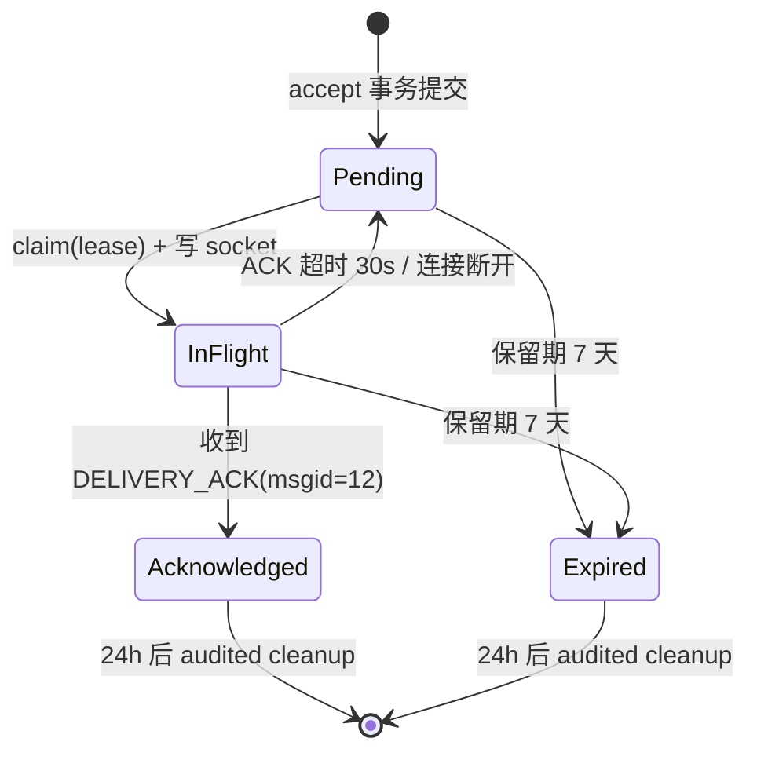

# muduo-chat

[](https://github.com/Makise0721/muduo-chat/actions/workflows/c-cpp.yml)

基于自研 [mymuduo](mymuduo/) 网络库（Reactor 模式，C++11 / epoll / Linux）构建的可靠聊天系统：双协议接入、持久化消息账本、at-least-once 投递、多网关集群与完整的可观测面。从课程级聊天服务器出发，按里程碑 M1→M5 演进为每个行为都有测试、每条数字都有出处的可验证分布式服务。

## 这是什么

仓库包含两层成果：

- **`mymuduo/`** — 参考陈硕 muduo 设计思想自研的网络库：EventLoop（one loop per thread）、epoll Poller、TcpServer/TcpConnection、有界发送与 outstandingBytes 背压语义、EventLoopThreadPool、异步日志、定时器队列，以及 v1/v2 两套协议编解码器。
- **`chatserver/`** — 业务系统：注册/登录/好友/群组之上的可靠消息层。核心是一条 durable 消息账本——消息、会话序列、投递记录、跨网关事件在同一个 MySQL 事务里提交后才应答发送方，之后由 ACK + 超时重投完成 at-least-once 投递，跨网关经 Outbox → Kafka 幂等消费。

## 架构

```
     v1 换行 JSON :6000         v2 二进制帧 :7000
              └────────────┬────────────┘
                           ▼
       mymuduo TcpServer ×2（共享主 EventLoop）
                           │
       ProtocolCodec（v1/v2 统一解析为 Command）
                           │
                           ▼
       ChatService（msgid 分发）
             keyed serial executor：阻塞 DB 工作移出
             EventLoop，按 key 串行，回包回 owner loop
                           │
                           ▼
 ChatApplication（用例编排 + 会话代次 generation fencing）
                           │
                           ▼
ReliableMessaging（durable accept · 重投 · 过期清理）
                           │
        ┌──────────────────┼────────────────────┬─────────────────────┐
        ▼                  ▼                    ▼                     ▼
  UserRepository      MessageStore      PresenceDirectory      GatewayTransport
        │                  │                    │                     │
        ▼                  ▼                    ▼                     ▼
      MySQL              MySQL                Redis                 Kafka
 （唯一消息真相源）  （账本 + outbox）  （presence fencing）  （跨网关 wakeup）
```

三个贯穿全库的设计决定：

- **Ports & Adapters + 契约双跑**：Repository / MessageStore / PresenceDirectory / GatewayTransport 都是接口；每个接口有 InMemory 与生产（MySQL/Redis/Kafka）两个 adapter，同一套契约测试对两者各跑一遍。生产路径固定 MySQL，InMemory 版本服务于契约测试与无依赖开发。
- **keyed serial executor**：阻塞 DB 工作按 key（登录前按连接，登录后按用户+会话代次）串行执行，完成后回到 owner EventLoop 回包——多 Reactor 扩线程不需要改一行业务代码。
- **会话代次（generation）fencing**：重连产生新代次，旧代次的迟到 completion、ACK 与投递一律作废，杜绝旧连接写坏新会话状态。

## 核心机制

### 可靠消息

发送方收到 `MESSAGE_ACCEPTED`（msgid=11）即表示消息已持久化：accept 事务内写入 `ChatMessage`（`UNIQUE(conversation_id, sequence)` 会话局部顺序）+ `MessageDelivery` + `OutboxEvent`。此后：



- **幂等接受**：`UNIQUE(sender_id, client_message_id)`——同一 `client_message_id` 重试返回原 MessageId 且 `duplicate=true`；缺该字段的 legacy 客户端走 implicit-ack 兼容路径（可经指标观测）。
- **重投**：指数退避 1s×2、上限 60s、±20% jitter；接收端按 MessageId 去重，整体语义为 at-least-once。
- **顺序承诺**：仅 Conversation 局部顺序（同会话内 ACK 放行下一条），不做全局顺序。
- 完整规范见 [docs/specs/message-reliability.md](docs/specs/message-reliability.md)，故障点矩阵见 [docs/specs/cluster-failure-contract.md](docs/specs/cluster-failure-contract.md)。

### 明确不承诺的事

- 不做 exactly-once（at-least-once + 客户端去重的取舍见 [ADR-0001](docs/adr/0001-reliable-message-semantics.md)）；
- 不做全局消息顺序；
- socket 写成功不等于送达（送达以 DELIVERY_ACK 为准）。

### 双协议

v1 为换行分隔 JSON（可用 telnet/netcat 直接调试），v2 为二进制帧封装同样的 JSON payload。msgid 与错误码对两协议一致：

| msgid | 含义 | msgid | 含义 |
|---|---|---|---|
| 1 / 2 | 登录 / 登录 ACK | 8 | 创建群组 |
| 3 | 登出 | 9 | 加入群组 |
| 4 / 5 | 注册 / 注册 ACK | 10 | 群聊 |
| 6 | 单聊 | 11 | MESSAGE_ACCEPTED（durable 应答）|
| 7 | 添加好友 | 12 / 13 | DELIVERY_ACK / ERROR_RESP |

错误码 errno 101..107 冻结：101 非群成员 / 102 超 fan-out 上限 / 103 幂等冲突 / 104 依赖忙 / 105 内容超长 / 106 目标不存在 / 107 非法 client_message_id。

v2 帧格式（20 字节大端头 + UTF-8 JSON 体，默认帧体上限 1 MiB，违例 forceClose）：

```
magic(4B)=0x4D434854 ("MCHT") | version(1B)=2 | flags(1B) | headerLength(2B)=20
bodyLength(4B) | messageType(2B) | contentType(1B)=JSON | reserved(1B) | requestId(4B)
```

协议 golden 样例（14 个冻结 JSON）在 [tests/fixtures/](tests/fixtures/)。

### 集群投递

多网关部署时（每网关一个进程，共享 MySQL/Redis/Kafka）：

1. accept 事务内写入 OutboxEvent；
2. 本网关 relay 以 lease 抢占批量事件发布到 Kafka（key=ConversationId）；
3. 每个网关独立消费组消费全量事件，幂等唤醒本地在线用户；
4. 用户在哪个网关登录，由 Redis presence 记录路由（Lua 原子脚本 + 全局单调 SessionEpoch）；投递前校验 epoch，旧 epoch 一律丢弃并留在 Pending 重路由。

Redis 故障时的降级是冻结行为：登录暂停、durable accept 继续，恢复后自动收敛。

## 快速开始

### 依赖

- Linux（验证环境 WSL2 Ubuntu 24.04）；CMake 3.10+；GCC 或 Clang（C++11）
- MySQL 8.x（必需，验证于 8.0.46）
- 可选：Redis、Kafka（仅集群投递与对应集成测试需要）

```bash
sudo apt-get install cmake build-essential libmysqlclient-dev
```

### 构建

```bash
cmake -S . -B build -DCMAKE_BUILD_TYPE=Release
cmake --build build -j
```

产物在 `bin/`：ChatServer、ChatClient、dbmigrate、backfill、chat-bench、logger-bench；库在 `lib/libmymuduo.so`。纯部署可加 `-DENABLE_TESTS=OFF`。

### 数据库迁移

```bash
export DB_PASSWORD=your_password
bin/dbmigrate --to 3 --db chat      # 应用 sql/migrations/ 到指定版本
bin/dbmigrate status --db chat      # 查看已应用版本与 checksum
```

### 运行

```bash
bin/ChatServer --config docker/configs/gw1.json   # 完整配置示例
DB_PASSWORD=your_password bin/ChatServer 127.0.0.1 6000   # 或位置参数
```

配置支持 JSON 文件 → CLI → 环境变量三级覆盖，非法即 fail-fast。关键缺省值：

| 配置段 | 缺省 |
|---|---|
| `server.v1` | 127.0.0.1:6000，threads=1 |
| `server.v2` | :7000 |
| `db` | root@127.0.0.1:3306/chat，连接池 5（密码读 `DB_PASSWORD`）|
| `executor` | 1 worker，队列容量 64 |
| `reliable` | ACK 超时 30s · 退避 1s×2 上限 60s ±20% jitter · 保留 7 天 · acked/expired 清理各 24h |
| `outbox` | 批量 100 · 扫描 5s · lease 30s |
| `gateway` | id=1 · Redis 127.0.0.1:6379 TTL 30s · Kafka :9092 · topic `muduo-outbox` · 消费组按 gateway id 派生 |
| `metrics` | 关闭（开启后 :7001 `/metrics`）|

### 客户端

```bash
bin/ChatClient 127.0.0.1 6000
```

## 测试与质量保障

```bash
ctest --test-dir build --output-on-failure
```

- **497 个用例**（M5 验收口径）在 Debug / ASan / TSan 三棵构建树全量通过；62 个 GTest 测试目标随主构建生成。
- **契约双跑**：同一套契约测试对 InMemory 与 MySQL adapter 各执行一遍；MySQL adapter 内置故障注入 hook，支撑 10 个 kill 点的故障矩阵进程测试。
- **进程级集成测试**：信号优雅关闭、fd 耗尽、双协议行为矩阵、多 Reactor、背压投递、崩溃恢复、三节点 chaos 等；全部依赖真实 MySQL/Redis/Kafka，不 skip。
- **CI**：GitHub Actions 在 ubuntu-latest 上起真实 MySQL8 service container、宿主 Redis 与 Kafka 容器跑全部门禁；唯一例外是背压进程测试因 4 核 runner 时序不确定改为非门禁的信息化运行（原因记录在 workflow 注释）。

## 性能

基线数据（2026-08，commit `350d4e2`，9 场景 × 5 重复，均值 + 95% CI）：echo ~21.4k msg/s（p99 0.56ms）、reliable-direct 全 ACK 路径 25.90 msg/s、hot 会话 51.90 msg/s；ChatServer 稳态 RSS ~16.4MB 无增长趋势。

方法学与边界声明：WSL2 虚拟化、回环网络、单机、Debug 构建——数字只用于阶段内相对比较，禁止外推为 SLA。完整报告与优化台账（含 FAIL/revert 记录）见 [docs/reports/performance/](docs/reports/performance/)，方法学冻结于 [docs/specs/benchmark-methodology.md](docs/specs/benchmark-methodology.md)。

## 多节点部署与可观测性

```bash
bash docker/build_rootfs.sh                 # 构建最小 rootfs 镜像
docker compose -f docker/compose.yml up -d
```

- 3 Gateway 容器（gw1/gw2/gw3，gateway.id=1/2/3）复用宿主 MySQL/Redis/Kafka；端口布局 gw1 v1=16201/v2=16211 起，逐网关递增。
- Prometheus（抓宿主 `/metrics`）+ Grafana 自动 provisioning："Chat Overview" 仪表盘 9 个 panel（ACK 延迟分位、oldest pending age、outbox/consumer lag、loop lag、连接拒绝率等）；告警规则在 `docker/prometheus/rules/`（SLO 标注 experimental）。
- 运行中向服务进程发 `SIGUSR1` 可打印与 `/metrics` 同源的兼容指标行。

## 项目结构

```
mymuduo/        网络库（EventLoop/Poller/TcpServer/Buffer/Logger + v1/v2 codec）
chatserver/
  include/app/  端口接口与领域类型（Repository/MessageStore/Presence/GatewayTransport…）
  src/app/      adapter 实现、ReliableMessaging、ProtocolCodec、Kafka/Redis 接线、观测
  src/db/       连接池、RAII MySQL 封装、schema migration runner、离线消息回填
sql/            chat.sql（旧五表）+ migrations/0001..0003（可靠消息六表 + 死信表）
tests/          unit/（GTest）、进程级集成 harness、fixtures/（协议 golden）、scripts/
tools/          dbmigrate（迁移 CLI）、backfill（旧表回填）、chat-bench、logger-bench、
                bench/run.py（benchmark 编排器）、chat_load.py
docker/         compose 三网关拓扑、rootfs 构建、Prometheus/Grafana 配置
docs/           specs / adr / reports / plans / process（导航见 docs/README.md）
thirdparty/     nlohmann/json（唯一直接第三方源码依赖）
```

## 文档地图

推荐阅读顺序：

1. [docs/README.md](docs/README.md) — 文档目录职责与维护规则
2. [docs/architecture/evolution-plan.md](docs/architecture/evolution-plan.md) — 目标架构与 M1–M5 里程碑演进
3. [docs/adr/](docs/adr/) — 两条难以逆转的设计决定（可靠消息语义、集群所有权与故障契约）
4. [docs/specs/](docs/specs/) — 协议、可靠性、schema、行为矩阵、benchmark 方法学五篇定稿
5. [docs/reports/](docs/reports/) — 各里程碑验收报告与性能数据

## 致谢

- [陈硕 muduo](https://github.com/chenshuo/muduo) — mymuduo 的设计思想来源
- [nlohmann/json](https://github.com/nlohmann/json)
