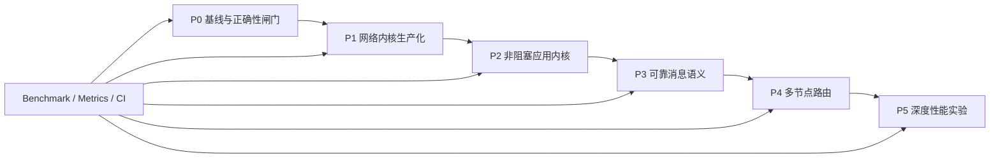
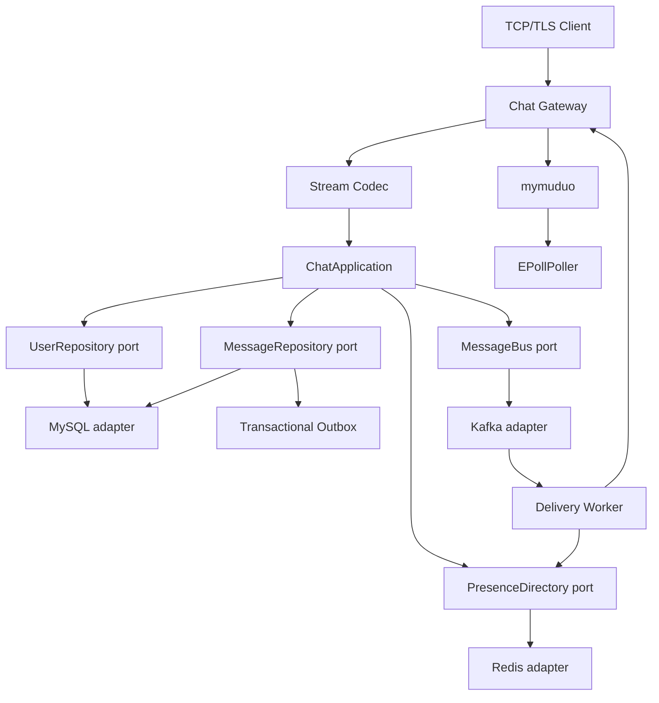

# muduo-chat 架构演进与扩展改造方案

状态：设计草案  
基线：`main` @ `1b94d43`  
目标：把当前单机聊天应用演进为“可验证的 C++ 事件驱动网络库 + 可靠分布式即时通信系统”，而不是技术栈陈列。

## 1. 结论先行

推荐路线不是把 brainstorm 的 52 项逐项实现，而是压缩成 6 条相互支撑的主线：

1. 网络正确性：连接生命周期、二进制 framing、Timer、背压和过载保护。
2. 非阻塞执行：I/O 线程只做非阻塞 I/O 和短回调，数据库及 CPU 重任务离开 EventLoop。
3. 消息语义：明确 ACK 点、幂等、重试、离线投递和会话级顺序。
4. 横向扩展：Gateway 无状态化、Redis Presence、事务 Outbox、Kafka 路由。
5. 性能工程：可复现 benchmark、尾延迟、perf/FlameGraph 和逐项对照实验。
6. 可靠性工程：单元/集成/并发/fuzz、Sanitizer、故障注入、可观测性和优雅退出。

实施顺序必须是：



不应先拆微服务或先接 Kafka。当前 EventLoop 回调内存在同步 MySQL 查询和无限期连接池等待；若此时直接开启更多 Reactor 或增加节点，只会把阻塞和状态一致性问题复制到更多线程与进程。

## 2. 当前基线：已有机制不重复造，缺失能力补完整

| 领域 | 仓库事实 | 判断与改造方向 |
|---|---|---|
| 自研网络库 | 已有 `EventLoop`、`Channel`、`Poller`、`EPollPoller`、`TcpServer`、`TcpConnection` | “自研 mini-muduo”已经成立，不再作为待办；先补测试、契约和生命周期正确性 |
| Buffer | 已有 prepend/read/write 三段区与 `readv + extrabuf` | 不重复实现；增加边界测试、只读接口和 Codec 所需的整数读写辅助 |
| Poller | 已有抽象，但只有 `EPollPoller`；`MUDUO_USE_POLL` 分支返回空指针 | 先以 deterministic test adapter 让 seam 真实可测；`io_uring` 必须由实验数据决定 |
| 多 Reactor | `EventLoopThreadPool` 和 round-robin 已实现 | `ChatServer` 未设置线程数，当前实际仍是默认单 loop；应在阻塞任务移出 I/O 线程后再启用 |
| TCP framing | 当前是一行一个 JSON，以 `\n` 分帧 | 保留为 v1 兼容协议；新增固定头 v2，不在同一端口猜测协议 |
| Backpressure | `TcpConnection` 已有 High Water Mark 回调 | 只有通知，没有暂停读、恢复读、硬上限和慢消费者超时，尚未形成完整能力 |
| 生命周期 | 已使用 `shared_from_this` 和 `Channel::tie` | 跨线程 `send` 仍捕获裸 `this` 和临时字符串 `data()`；需先修复并用 ASan/TSan 覆盖 |
| Timer | 未找到 TimerQueue/timerfd 接入 | 新增 EventLoop 计时器接口，心跳、超时、重试统一使用同一模块 |
| 业务执行 | `ChatService` 同时解析 JSON、持有连接、写 SQL、路由消息 | 是浅模块集群；改为可注入的 `ChatApplication`，网络、领域编排、存储各自形成深模块 |
| 数据库 | 连接池获取会无限等待；核心 SQL 仍由 handler 同步执行 | 增加超时和 DB executor；SQL 收进 Repository adapter；业务 handler 不再接触 MySQL C 接口 |
| Prepared Statement | 有基础包装，但主路径未迁移 | 不继续扩充通用 C API 包装；由 MySQL Repository 内部实现具名查询与完整参数绑定 |
| 日志 | 全局 Logger 同步写 `std::cout`，日志级别为共享可变状态 | 改为一次调用携带级别的异步批量日志，定义队列满时的丢弃/阻塞策略 |
| 退出 | 信号处理器直接访问业务状态并 `exit(0)` | 改为 signalfd/self-pipe 唤醒 EventLoop，执行可观察的 drain 状态机 |
| 测试与性能 | 无 CTest、单元测试、fuzz、benchmark | P0 建立闸门；在没有固定硬件、负载和原始报告前，不宣称“10 万连接”或延迟数字 |

### 2.1 必须先处理的正确性风险

- `TcpConnection::send()` 的跨线程路径把 `message.data()` 和裸 `this` 放入延迟回调。调用返回后字符串可能失效，连接也可能先析构。
- `ConnectionPool::getConnection()` 无限期等待，且从 EventLoop 消息回调直接调用；一个慢查询或池耗尽会阻塞该 loop 上所有连接。
- High Water Mark 只触发一次回调，输出缓冲仍可继续无界增长。
- `signal()` handler 内执行锁、数据库和 `exit()` 等非异步信号安全操作。
- `Logger::setLogLevel()` 修改单例共享状态，多线程日志可能出现级别串扰；同步输出也会直接进入热路径。

P0 不扩大业务能力，只把这些风险变成可复现测试并建立修复闸门。

## 3. 目标模块与 seam

设计原则：让调用者只学习小接口；复杂性由模块内部承担。只有存在生产 adapter 与测试/本地 adapter 时才建立 seam。

### 3.1 目标拓扑



第一阶段所有业务模块仍可在一个进程中运行。只有当 `ChatApplication` 的 in-process adapter 已稳定、确实需要独立伸缩时，才把 Gateway、Message/Delivery 拆成进程，并新增 RPC adapter。这样部署形态变化不迫使领域逻辑重写。

### 3.2 深模块清单

| 模块 | 小接口 | 隐藏的实现复杂性 | Adapters / 测试面 |
|---|---|---|---|
| `StreamCodec` | `decode(Buffer&, Frame&) -> DecodeResult`；`encode(Frame, Buffer&)` | 半包/粘包、大小上限、字节序、版本、错误分类 | `LegacyJsonLineCodec`、`BinaryFrameCodec`；同一组契约测试 |
| `TcpConnection` | `send(std::string) -> SendResult`、`shutdown()`、只读状态 | 线程切换、数据所有权、写缓冲、背压状态机、loop-affine 销毁 | `socketpair` 集成测试；不向业务暴露 Buffer 水位细节 |
| `TimerQueue` | `runAfter`、`runEvery`、`cancel` | monotonic clock、timerfd、重复定时器漂移、取消竞态 | timerfd adapter + deterministic clock/driver adapter |
| `BlockingExecutor` | `submit(work, originLoop, completion)` | 有界队列、超时、关闭、回到原 EventLoop、指标 | 线程池 adapter + inline deterministic adapter |
| `ChatApplication` | `handle(SessionContext, Command, Reply)` | 鉴权、用例编排、错误映射、事务选择 | 通过 ports 使用 in-memory 与生产 adapters 测试 |
| `UserRepository` | 面向用例的少量查询/命令 | SQL、预处理语句、连接池、错误转换 | MySQL adapter + in-memory adapter |
| `MessageRepository` | `accept`、`loadPending`、`ack` | 幂等键、会话序号、消息/投递状态、Outbox 原子写 | MySQL adapter + in-memory adapter |
| `PresenceDirectory` | `claim`、`locate`、`release` | TTL、session epoch、原子 compare-delete、节点失效 | Redis adapter + in-memory adapter |
| `MessageBus` | `publish`、`subscribe` | 分区键、重试、offset、反压 | Kafka adapter + in-process adapter |
| `Telemetry` | counter/gauge/histogram 与结构化事件 | 聚合、导出、采样、异步写盘 | Prometheus/OTel adapter + test recorder |

不要为每张表创建一个公开 Repository。接口应围绕用例，例如“接受一条消息并生成序号”，而不是暴露 `insertMessage`、`insertOutbox` 等事务内部步骤。

## 4. 网络与协议设计

### 4.1 v2 framing

不要直接 `reinterpret_cast<MessageHeader*>`；结构体填充、对齐和主机字节序都不属于线协议。固定 20 字节头，逐字段按 network byte order 编解码：

| Offset | 长度 | 字段 | 约束 |
|---:|---:|---|---|
| 0 | 4 | magic | 固定 `0x4D434854`（`MCHT`） |
| 4 | 1 | version | 首版为 2 |
| 5 | 1 | flags | 仅允许已定义 bit |
| 6 | 2 | header_length | v2 固定 20，支持未来扩展 |
| 8 | 4 | body_length | 默认最大 1 MiB；配置有全局硬上限 |
| 12 | 2 | message_type | 协议枚举，不复用当前隐式自增值 |
| 14 | 1 | content_type | JSON=1，Protobuf=2；首个里程碑只实现 JSON |
| 15 | 1 | reserved | 必须为 0 |
| 16 | 4 | request_id | 请求/响应关联，不承担消息幂等语义 |

`decode` 只有四类可观察结果：

- `NeedMore`：输入不足，不消耗 Buffer。
- `FrameReady`：恰好消耗一帧，调用者继续循环。
- `UnsupportedVersion`：返回版本错误并关闭连接。
- `ProtocolError`：magic、长度、flags 或 body 非法；计数后关闭，不按声明长度分配。

首版不增加 CRC。TCP 已提供链路校验，未来 TLS 还会提供完整性；只有故障实验能证明端到端静默损坏是现实需求时才增加校验字段。

### 4.2 兼容迁移

- `:6000` 保留 v1 newline JSON，使用 `LegacyJsonLineCodec`。
- `:7000` 提供 v2 binary framing，使用 `BinaryFrameCodec`。
- 不在同一端口用首字节猜测协议，避免歧义、降级和 parser attack surface。
- 两个 codec 输出相同 `Command`，后续业务不感知传输格式。
- v2 客户端、集成测试与 benchmark 完成后，才记录 v1 deprecation 日期；删除 v1 是单独提交。

### 4.3 连接生命周期与发送所有权

`send` 改为按值接收拥有的数据，跨线程闭包同时持有 `shared_ptr<TcpConnection>` 和消息对象。所有 Channel 变更、状态迁移和最终销毁都回到所属 EventLoop。

状态机必须幂等：

```text
Connecting -> Connected -> Disconnecting -> Disconnected
                    \-----------------------> Disconnected
```

需要覆盖：并发 send/close、对端 RST、写完成回调排队后关闭、服务器 drain、重复 shutdown。测试只观察发送结果、回调次数和资源释放，不读取私有状态。

### 4.4 背压与过载

背压策略由 `TcpServerOptions` 一次配置，业务 handler 不操作阈值：

```cpp
struct WriteBufferLimits {
    size_t pauseReadBytes;
    size_t resumeReadBytes;
    size_t hardLimitBytes;
    std::chrono::milliseconds stallTimeout;
};
```

状态机：

```text
Normal --达到 pauseRead--> Backpressured --降至 resumeRead--> Normal
Backpressured --达到 hardLimit 或超时--> Closing
```

约束：`resumeReadBytes < pauseReadBytes` 且 `resumeReadBytes < hardLimitBytes`（一般配置 `resumeReadBytes < pauseReadBytes < hardLimitBytes`）。P1-07 起允许硬上限独占模式 `hardLimitBytes <= pauseReadBytes`：该模式下 hard 分支（达界即启动 stall 定时器）优先于读暂停，Backpressured 即关闭倒计时；当 `2 * hardLimitBytes <= pauseReadBytes` 时达界路径不可能触发 `checkPause`，**无降至 resumeRead 的恢复路径**；否则单条近限消息（append 前检查，最大 overshoot < hardLimitBytes）可能越过 pause 触发读暂停，恢复路径存在（缓冲降至 resumeRead 即取消 stall）——两种子情形由 stall 定时器幂等（stallActive_ 防重）保证语义一致。该模式用于可测试性与"硬上限优先于读暂停"的策略选择。默认值通过 benchmark 确定，不把 brainstorm 中 1/16/64/128 MiB 当成未经验证的事实。`send` 返回 `Accepted / Backpressured / Closed / TooLarge`，让上层停止继续生产，而不是只记录回调后继续堆积。

进程级过载还需覆盖：最大连接数、accept 速率、每用户/连接 token bucket、EventLoop 延迟、任务队列长度、EMFILE idle-fd 处理。优先拒绝新负载，不能让已有连接一起 OOM。

### 4.5 Timer、心跳和退出

- `TimerQueue` 以 monotonic clock 为截止时间，timerfd 只负责唤醒。
- 心跳只更新连接活跃时间；空闲回收通过 TimerQueue 完成。
- 初版使用最小堆或有序容器。只有 10 万级定时器 benchmark 证明 O(log N) 为瓶颈后才实现 Timing Wheel。
- SIGINT/SIGTERM 只写 self-pipe/signalfd；EventLoop 执行 `StopAccepting -> Drain -> Flush -> Close -> StopLoops`。
- drain 设硬截止时间；到期后记录未完成请求数并强制关闭，避免永不退出。

## 5. 非阻塞应用内核

### 5.1 线程规则

唯一硬规则：I/O thread only performs non-blocking I/O and short callbacks。

禁止在 EventLoop 直接执行：

- `ConnectionPool::getConnection()` 或任何 MySQL/Redis/Kafka 阻塞调用；
- 大 JSON/Protobuf 解析、压缩、加密；
- 同步日志落盘；
- 无界循环或等待其他线程。

`BlockingExecutor` 使用有界队列。队列满返回 overload，而不是阻塞 EventLoop。任务完成后只通过 `originLoop.queueInLoop()` 回到原 loop，再检查 session epoch/连接是否仍有效后发送响应。

### 5.2 从 `ChatService` 迁移

当前 `ChatService` 同时承担传输、解析、SQL、在线连接表和用例编排。按纵向用例迁移，不一次性重写：

1. 先定义 `Command`、`Reply`、`DomainError`，使 handler 不再接触 JSON。
2. 迁移注册用例到 `ChatApplication`，使用 `UserRepository`。
3. 再迁移登录/登出与 Presence。
4. 最后迁移单聊、群聊、离线消息到 `MessageRepository`。
5. 每迁移一个用例，旧入口只做 codec 转换；新测试通过 `ChatApplication` 接口验证行为。

旧函数级测试在新接口契约测试稳定后删除，避免同时维护两套实现细节测试。

### 5.3 数据访问

- MySQL adapter 内部只暴露具名操作，不把 `MYSQL*`、SQL 字符串或结果集泄漏给应用模块。
- 获取连接必须有 deadline；超时转换为 `DependencyBusy`，进入 metrics 和限流策略。
- 所有用户输入使用 prepared statement；不再依赖转义后拼 SQL。
- 连接池先实现 `minSize/maxSize/acquireTimeout/maxIdle` 的可观察行为；动态扩缩容必须有并发测试后再启用。
- 只有 DB executor 隔离完成并通过 TSan/压测，才在 `ChatServer` 启用多个 I/O loops。

## 6. 可靠消息语义

### 6.1 精确承诺

目标承诺是：

- 服务器返回 `MESSAGE_ACCEPTED` 前，消息、会话序号和 Outbox 事件已在同一 MySQL 事务提交。
- 已接受消息采用 at-least-once delivery；网络和消费者故障时允许重复。
- 客户端以 `message_id` 幂等去重；服务端以 `(sender_id, client_message_id)` 幂等接受重试。
- 只保证 conversation-level ordered acceptance/delivery，不承诺全局顺序。
- `DELIVERY_ACK` 表示接收端客户端已确认，不等同于 TCP write 成功。

“绝不丢、绝不重、严格有序”不作为宣传口径。

### 6.2 数据模型

建议替换当前单列 `OfflineMessage.message` 的隐式生命周期：

```text
Conversation(id, type, next_sequence)
Message(id, conversation_id, sender_id, client_message_id,
        sequence, payload, created_at)
Delivery(message_id, recipient_id, status, attempts,
         next_retry_at, delivered_at, acked_at)
Outbox(id, aggregate_id, event_type, payload, published_at)
```

关键约束：

- `UNIQUE(sender_id, client_message_id)`：客户端重试幂等。
- `UNIQUE(conversation_id, sequence)`：会话序号唯一。
- `PRIMARY KEY(message_id, recipient_id)`：每个接收者一条投递状态。
- Message 与 Outbox 同事务写入；relay 发布成功后标记 `published_at`。

状态迁移：

```text
pending -> delivered -> acked
    |           |
    +---- retry +
```

登录拉取不能读取后立即删除；直到客户端 ACK 才进入 `acked`，再由保留策略异步清理。

### 6.3 会话顺序

初版由 MySQL 事务对 Conversation 的 `next_sequence` 原子递增，返回序号。进入 Kafka 后用 `conversation_id` 作为 partition key。多 worker 可以并行处理不同会话，同一会话固定进入一个分区。

热点群导致单分区瓶颈时，先用指标确认，再决定是否牺牲顺序或分层 fan-out；不提前引入全局排序器。

## 7. 多节点架构

### 7.1 Presence 与 session fencing

Redis 保存：

```text
presence:{user_id} -> {gateway_id, connection_id, session_epoch}, TTL
```

- 登录 `claim` 生成单调递增 `session_epoch`。
- 心跳续租必须携带相同 epoch。
- 断开 `release` 使用 Lua/事务 compare-and-delete，旧连接不能删除新连接的 Presence。
- 投递消息携带 epoch；Gateway 丢弃发往旧 session 的消息。

Redis 不保存消息真相，只保存可过期路由状态和缓存。Redis 不可用时进入明确降级：暂停新登录/跨节点在线直投，但已接受消息仍写入 MySQL 并等待后续投递。

### 7.2 Kafka 与跨节点投递

1. Outbox relay 发布 `MessageAccepted`，key=`conversation_id`。
2. Delivery worker 创建/更新接收者 Delivery，查询 Presence。
3. 在线用户：向目标 Gateway 投递；离线用户：保持 pending。
4. Gateway 写入客户端后不能直接标记 acked；收到客户端 `DELIVERY_ACK` 后更新。
5. consumer 重放必须幂等，重复 event 不产生重复 Delivery 行。

Redis Pub/Sub 只允许作为 P4 之前的可丢消息 spike，用来验证跨节点路由；不得替代 Outbox/Kafka 的可靠路径，也不得形成长期双实现。

### 7.3 RPC、服务发现和一致性哈希的进入条件

- RPC：只有 Gateway 与 Message/Delivery 确实拆成独立进程时才增加。复用 v2 frame，至少有 in-process adapter 和 TCP adapter，超时/取消/过载是接口的一部分。
- 服务发现：Docker Compose/静态配置不能满足动态实例上下线时，再增加 etcd adapter；先不引入 ZooKeeper/etcd 二选一之外的第二套系统。
- 一致性哈希：只有出现“需要稳定分配所有权的有状态 shard”时才实现。Presence 定位和 Kafka partition 已解决的路由，不再重复套一层哈希环。
- 仓库拆分：`mymuduo` 接口稳定、有独立 CI、版本和兼容性测试后再独立发布；此前保留 monorepo 降低协同成本。

## 8. 可观测性与性能方法

### 8.1 从 P0 就采集的指标

- `active_connections`、`accepted/rejected_connections_total`
- `frames_total{type,result}`、`protocol_errors_total{reason}`
- `event_loop_delay_seconds` histogram（每个 loop 独立）
- `output_buffer_bytes` histogram、`backpressure_connections`
- `executor_queue_depth`、`executor_rejected_total`
- `db_acquire/query_latency_seconds`、`db_pool_in_use`
- `message_accept/delivery/ack_latency_seconds`
- `outbox_lag_seconds`、`kafka_consumer_lag`

高频计数器按 loop/thread 分片，采集时聚合；是否需要 `alignas(64)` 必须由 cache miss/false sharing 数据决定。

### 8.2 `chat-bench` 场景

自研 TCP 客户端而不是使用面向 HTTP 的 `wrk`：

| 场景 | 变量 | 输出 |
|---|---|---|
| idle-connections | 连接数、心跳间隔、持续时间 | 建连成功率、RSS/conn、loop delay |
| echo | payload、连接数、发送速率 | msg/s、Gbps、p50/p95/p99/p99.9/max |
| chat-local | 在线率、会话数、fan-out | 端到端延迟、失败率、DB 延迟 |
| slow-consumer | 客户端读取速率 | 内存上界、暂停/恢复/断开次数 |
| reconnect-storm | 每秒连接/登录数 | accept 拒绝、CPU、恢复时间 |
| cluster-failure | kill Gateway/Redis/Kafka、网络延迟 | 已接受消息结果、重复率、恢复时间 |

报告必须记录：commit、编译器/flags、CPU/NUMA、内核、ulimit、依赖版本、payload、连接模型、warm-up、持续时间、原始结果路径。所有优化遵循 `Baseline -> Profile -> Single change -> Measure -> Diff review`。

### 8.3 暂不进入主线的实验

| 实验 | Go 条件 | No-go / 回滚条件 |
|---|---|---|
| `io_uring` Poller | epoll 在目标负载中有可归因 syscall/调度瓶颈，并可保持同一 EventLoop 接口 | 只在微基准赢、真实 chat workload 无显著收益或复杂度过高 |
| MPSC/lock-free queue | `pendingFunctors_` mutex 竞争在 profile 中占显著比例 | p99 无改善、TSan/正确性成本高 |
| 内存池/jemalloc | malloc/free 在 FlameGraph 中为热点且对象生命周期可分类 | RSS、碎片或尾延迟变差 |
| Timing Wheel | TimerQueue 在 10 万+ 活跃 timer 下成为 CPU/延迟瓶颈 | 普通最小堆已满足目标 |
| sendfile/splice | 产品加入附件/静态文件路径 | 纯聊天帧路径无文件传输，不为展示而实现 |
| Coroutine | callback 业务链的可维护性已有量化问题，且与既有 loop 能清晰集成 | 只是语法改写或引入双运行时 |
| TLS | framing、背压、连接状态稳定并有握手压测 | 用阻塞 SSL 调用破坏 EventLoop 规则 |
| NUMA/CPU affinity | 专用多 NUMA Linux 主机上已出现远端内存/调度证据 | 开发机或单 NUMA 结果外推 |

## 9. 分阶段、测试优先实施清单

每个任务遵循固定节奏：先加入失败测试，运行聚焦检查确认只因目标行为失败；做最小实现；运行聚焦与回归；审查 diff；一个任务一个原子提交。

### P0：基线与正确性闸门

#### P0-01 CMake/CTest 测试骨架

- 接口/行为：`ENABLE_TESTS=ON` 可构建独立测试；默认生产构建不依赖测试框架。
- 失败测试：添加最小 `Buffer` 契约测试，确认 CTest 尚无目标。
- 最小实现：引入一个测试框架、`tests/unit`、CTest 注册和统一 test helper。
- 验证（Linux/WSL2/CI，依次执行）：`cmake -S . -B build -DENABLE_TESTS=ON`、`cmake --build build --parallel`、`ctest --test-dir build --output-on-failure`。
- 完成定义：clean checkout 可执行；无 MySQL 的 unit tests 可运行。
- 提交：`test: establish ctest baseline`。

#### P0-02 网络特征测试

- 接口/行为：锁定 Buffer 半包/多包、EventLoop wakeup、ThreadPool round-robin、连接回调次数等当前正确行为。
- 失败测试：逐项添加，先暴露真实偏差，不按文档假设行为。
- 最小实现：只修复阻止测试表达契约的缺陷，不重构实现。
- 验证：`ctest --test-dir build -R 'Buffer|EventLoop|TcpServer' --output-on-failure`。
- 完成定义：测试只经过公开接口，内部容器变化不影响测试。
- 提交：按 Buffer/EventLoop/TcpConnection 分开提交。

#### P0-03 跨线程 send/close 生命周期修复

- 接口/行为：调用者返回或连接同时关闭后，已接受发送要么完成，要么报告关闭；不能 UAF/double free。
- 失败测试：`socketpair` 上从非 loop 线程发送临时字符串，同时关闭连接；ASan 复现悬空数据/对象风险。
- 最小实现：`send(std::string)` 获得数据所有权，闭包捕获 `shared_ptr` 与移动后的消息；shutdown/close loop-affine 且幂等。
- 验证：聚焦测试 + ASan 构建；TSan 单独构建运行竞态用例。
- 完成定义：10000 次竞争循环无 sanitizer 报告，回调至多一次。
- 提交：`fix(net): own cross-thread send lifetime`。

#### P0-04 可复现 benchmark 基线

- 接口/行为：`chat-bench` 先支持 connect/echo/slow-consumer，输出机器可读 JSON。
- 失败测试：结果 schema/百分位计算单元测试先失败。
- 最小实现：固定速率发生器、HDR 类 histogram 或等价实现、metadata 记录。
- 验证：短 smoke benchmark + JSON schema test；正式基线只在固定 Linux 主机运行。
- 完成定义：报告能由同一命令重跑，包含 commit 与环境元数据。
- 提交：`bench: add reproducible tcp baseline`。

### P1：网络内核生产化

#### P1-01 `StreamCodec` 与 v2 framing

- 接口/行为：按第 4.1 节返回四类 decode 结果；半包不消费、粘包逐帧消费、非法长度不分配。
- 失败测试：header 逐字节截断、两帧粘连、0/上限/超上限 body、非法 magic/version/flags、大小端 golden bytes。
- 最小实现：`Frame`、`DecodeResult`、二进制 Codec；复用现有 Buffer。
- 验证：Codec 单测 + libFuzzer smoke；v1 契约不变。
- 完成定义：golden wire format 固化；fuzz corpus 无 crash/OOM/hang。
- 提交：`feat(protocol): add bounded v2 frame codec`。

#### P1-02 双协议迁移

- 接口/行为：v1/v2 不同 listener，输出相同 Command/Reply；协议不能跨端口降级。
- 失败测试：同一注册/登录/聊天场景对两个 codec 得到等价结果。
- 最小实现：把 newline 解析移入 `LegacyJsonLineCodec`；ChatServer 只协调连接与应用入口。
- 验证：双端口 integration tests。
- 完成定义：旧客户端继续工作；新客户端不依赖 newline。
- 提交：`refactor(protocol): isolate legacy and v2 codecs`。

#### P1-03 TimerQueue

- 接口/行为：`runAfter/runEvery/cancel`；取消后不执行；重复 timer 基于计划时间推进，避免累计漂移。
- 失败测试：相同 deadline 次序、回调中取消、跨线程添加/取消、loop 退出、时钟跳变。
- 最小实现：monotonic Timer、最小堆/有序容器、timerfd Channel。
- 验证：deterministic clock 单测 + timerfd integration test。
- 完成定义：公开测试不读取容器；TSan 无竞态。
- 提交：`feat(net): add event-loop timer queue`。

#### P1-04 背压状态机

- 接口/行为：达到 pause 阈值停止读，降至 resume 恢复，达到 hard/timeout 关闭；`send` 返回明确结果。
- 失败测试：socketpair 对端不读；验证内存上界、状态迁移和恢复，不依赖 sleep 轮询。
- 最小实现：`startRead/stopRead`、low-water 通知、stall timer、server 级 options。
- 验证：unit/integration + `chat-bench slow-consumer`。
- 完成定义：输出缓冲有硬上界，慢连接不拖垮正常连接的 p99。
- 提交：`feat(net): enforce bounded connection backpressure`。

#### P1-05 过载保护与优雅退出

- 接口/行为：连接/速率/队列超限可观察地拒绝；SIGTERM 后停止 accept、drain、到期退出。
- 失败测试：fd exhaustion、reconnect storm、退出时有 pending write/timer/task。
- 最小实现：idle-fd、accept limiter、shutdown coordinator。
- 验证：integration + 进程级 fault tests。
- 完成定义：拒绝原因有 metrics；退出码和未完成计数可断言。
- 提交：过载与退出各一个提交。

#### P1-06 异步结构化日志

- 接口/行为：一次调用携带 level/context；有界队列；满队列策略可观察；fatal 强制 flush。
- 失败测试：多线程级别不串扰、滚动/flush、队列满、进程退出。
- 最小实现：thread-local/current buffer + logging thread 双缓冲；不先实现通用日志生态。
- 验证：单测 + sync/async 对照 benchmark。
- 完成定义：热路径不做磁盘 I/O，丢日志数量有 counter。
- 提交：`feat(logging): add bounded async logger`。

### P2：非阻塞应用内核

#### P2-01 `ChatApplication` 纵向切片

- 接口/行为：注册用例只接受 Command/SessionContext，异步返回 Reply，不依赖 JSON/TcpConnection/MySQL。
- 失败测试：成功、重名、非法输入、Repository 失败/超时。
- 最小实现：Command/Reply/DomainError + `UserRepository` in-memory adapter；旧 handler 转发。
- 验证：纯内存 unit test + 旧协议 integration regression。
- 完成定义：测试通过应用 interface，无网络/数据库。
- 提交：`refactor(app): extract registration use case`，之后每个用例一个提交。

#### P2-02 MySQL Repository 与 prepared statements

- 接口/行为：生产 adapter 满足与 in-memory adapter 相同的契约，输入不改变 SQL 结构。
- 失败测试：引号、NUL、emoji、超长输入、唯一键冲突、断线/超时。
- 最小实现：具名 prepared operations 与错误映射；不暴露通用 SQL。
- 验证：Docker MySQL contract tests；运行 schema migration from scratch。
- 完成定义：核心业务路径无拼接用户输入 SQL。
- 提交：按 User/Message Repository 分开。

#### P2-03 `BlockingExecutor` 与 DB deadline

- 接口/行为：I/O loop 提交后立即返回；完成回原 loop；队列满/超时/关闭均有结果。
- 失败测试：慢 DB adapter 时 event-loop probe 仍准时；连接关闭后 completion 不发送旧 session。
- 最小实现：有界 worker pool、deadline、origin loop callback、session epoch check。
- 验证：deterministic test + slow dependency integration + metrics assertion。
- 完成定义：依赖延迟不再线性抬高同 loop 其他连接的 event-loop delay。
- 提交：`feat(runtime): isolate blocking database work`。

#### P2-04 启用多 Reactor

- 接口/行为：线程数可配置；每条连接固定所属 loop；跨 loop 操作只经 queueInLoop。
- 失败测试：2/4 loops 并发登录、聊天、断开；TSan race suite。
- 最小实现：ChatServer 传入 thread count；清理共享连接表或按 loop/shard 管理。
- 验证：TSan + 1/2/4/8 loop scalability curve。
- 完成定义：正确性先通过；只有吞吐/尾延迟报告后才选择默认线程数。
- 提交：`feat(server): enable configurable io loops`。

### P3：可靠消息

#### P3-01 Message/Delivery/Outbox schema

- 接口/行为：`accept` 原子生成 message id、conversation sequence、delivery 和 outbox；重复 client id 返回同一结果。
- 失败测试：任一事务步骤故障、并发同 id、并发同 conversation。
- 最小实现：向前兼容 migration + Repository contract。
- 验证：MySQL integration 与并发测试；从空库升级和回滚演练。
- 完成定义：无部分 Message/Outbox 状态；唯一约束生效。
- 提交：schema 与 adapter 分开，schema 提交只含 migration。

#### P3-02 ACK、重试与离线生命周期

- 接口/行为：accepted/delivered/acked 含义符合第 6 节；ACK 丢失会重投但不重复展示。
- 失败测试：accept 回复丢失、投递后 ACK 丢失、客户端重连、重复 ACK、过期消息。
- 最小实现：协议字段、retry scheduler、client/server dedup、retention worker。
- 验证：进程级 fault integration；记录重复投递与去重 counters。
- 完成定义：故障点结果与承诺一致，旧 OfflineMessage 完成迁移后再删除。
- 提交：accept、delivery、cleanup 各自原子提交。

#### P3-03 会话级顺序

- 接口/行为：同 conversation 的 accepted sequence 严格递增；不同 conversation 可并行。
- 失败测试：多 producer、多 worker、重试和进程重启下的序号/投递顺序。
- 最小实现：DB sequence allocation；Kafka 前先以 in-process bus 验证契约。
- 验证：并发 integration + property test。
- 完成定义：无序号重复/倒退；文档明确不保证全局顺序。
- 提交：`feat(message): guarantee conversation sequencing`。

### P4：多节点

#### P4-01 Redis Presence

- 接口/行为：claim/renew/locate/release 使用 session epoch；旧连接不能删除/接收新 session 数据。
- 失败测试：快速重登、旧节点延迟 release、TTL 过期、Redis timeout/down。
- 最小实现：in-memory contract adapter + Redis Lua adapter。
- 验证：Redis integration + failover tests。
- 完成定义：所有状态迁移原子，降级行为有测试和指标。
- 提交：`feat(cluster): add fenced presence directory`。

#### P4-02 Outbox relay 与 Kafka

- 接口/行为：未发布 outbox 可重放；重复 publish/consume 幂等；conversation key 固定分区。
- 失败测试：commit 后 relay 前 crash、publish 后标记前 crash、consumer 处理后 commit offset 前 crash。
- 最小实现：批量 relay、Kafka adapter、幂等 consumer。
- 验证：Kafka integration + kill/restart fault matrix。
- 完成定义：所有已接受消息最终可投递或进入可查询 dead-letter 状态。
- 提交：relay、producer、consumer 分开。

#### P4-03 Gateway 定向投递与集群演练

- 接口/行为：Delivery 只投给 Presence 指向的 gateway+epoch；节点丢失后消息保持 pending 并可恢复。
- 失败测试：Alice/Bob 分处两节点、Gateway 崩溃、网络分区、重连到新节点。
- 最小实现：先 in-process gateway adapter，进程拆分时再加 TCP RPC adapter。
- 验证：3 Gateway Docker Compose + chaos tests。
- 完成定义：跨节点与本地消息遵守同一 ACK/顺序契约。
- 提交：路由和部署各一个提交。

### P5：证据驱动优化与可观测性完善

#### P5-01 Metrics、Dashboard、Tracing

- 接口/行为：第 8.1 节指标可抓取；trace 贯穿 Gateway -> Message -> Kafka -> Delivery。
- 失败测试：test recorder 断言 span parent、错误状态和 label cardinality 上限。
- 最小实现：Prometheus exporter；拆进程后再启用 OpenTelemetry context propagation。
- 验证：compose smoke + dashboard query tests。
- 完成定义：可从一个 message_id 定位各阶段耗时，不把 user_id/message_id 作为高基数 metric label。
- 提交：metrics 与 tracing 分开。

#### P5-02 Profile -> Optimize -> Measure 循环

- 接口/行为：每个候选优化有 ADR、基线、单一变更、原始报告和回滚结论。
- 失败测试：不是传统红灯测试；先用 profile 证明瓶颈和定义性能门槛。
- 最小实现：一次只做 batching、allocator、queue、Poller 等一个变量。
- 验证：同机 A/B，多轮运行，报告 p50/p99.9、CPU、RSS、syscall、context switch、cache miss。
- 完成定义：收益可重复且正确性/复杂度可接受；未获益实验也保留结论但不合入主线实现。
- 提交：每项实验独立分支/提交，不混合功能改动。

## 10. CI 与发布闸门

项目依赖 Linux epoll；Windows 只适合编辑和部分纯计算测试，不能把 Windows 本地未执行路径称为已验证。

| Pipeline | 频率 | 闸门 |
|---|---|---|
| format/static | 每 PR | clang-format check、clang-tidy/cppcheck（逐步启用，基线告警不一次清空） |
| unit | 每 PR | Debug/Release，GCC/Clang，CTest |
| ASan+UBSan | 每 PR | unit + network integration |
| TSan | 每 PR 或独立必需 job | concurrency suite；不与 ASan 混跑 |
| fuzz smoke | 每 PR | 固定 corpus 与时间预算 |
| MySQL/Redis/Kafka integration | 每 PR | contract + schema + process tests |
| benchmark smoke | 每 PR | 只防数量级退化，不用共享 runner 产出宣传数据 |
| dedicated benchmark | 每日/里程碑 | 固定裸机、原始报告、与基线的置信区间 |
| chaos | 每日/里程碑 | kill、delay、packet loss、dependency outage、恢复断言 |

任何阶段的完成都同时要求：聚焦测试通过、全量回归通过、Sanitizer 对应路径通过、文档/协议/schema 同步、diff 只包含本任务、benchmark 无未解释回退。

## 11. 里程碑与停止条件

| 里程碑 | 可展示成果 | 进入下一阶段的硬条件 |
|---|---|---|
| M0 可测试单机 | CTest、生命周期修复、可复现基线 | P0 风险有回归测试，Linux CI 绿 |
| M1 网络框架 v2 | Codec、Timer、背压、退出、异步日志 | slow-consumer 内存有界，fuzz/sanitizer 绿 |
| M2 非阻塞聊天内核 | ChatApplication、Repository、DB executor、多 Reactor | 慢 DB 不阻塞 loop，1/2/4/8 loop 有实测曲线 |
| M3 可靠单机消息 | durable accept、ACK/retry/dedup/order | 故障矩阵与语义承诺一致 |
| M4 可靠多节点 | Presence fencing、Outbox/Kafka、跨 Gateway | 3 节点 chaos 后已接受消息可恢复、旧 session 不误投 |
| M5 性能研究版 | perf/FlameGraph、若干有证据优化、完整报告 | 每个简历数字可定位到 commit、环境和原始报告 |

若某阶段的正确性闸门未通过，不并行推进依赖它的后续架构。尤其是：P0 未完成不做 io_uring，P2 未完成不开多 Reactor，P3 未完成不上 Kafka 可靠链路。

## 12. 配套文档产物

随着实现逐步维护，而不是预先写成“已完成”：

- `docs/IMPLEMENTATION_SOP.md`：WSL 环境、单任务执行循环、验证闸门与当前可执行队列。
- `docs/architecture.md`：当前已落地拓扑和模块 interface。
- `docs/protocol-v2.md`：golden bytes、错误码、兼容策略。
- `docs/message-reliability.md`：ACK 点、状态机、故障矩阵。
- `docs/benchmark-methodology.md`：环境、负载与统计方法。
- `docs/performance-reports/<commit>.md`：每次正式测量结果。
- `docs/adr/`：为何选择双端口、Outbox/Kafka、会话级顺序，以及被拒方案。

最终对外叙述只陈述仓库和测试能证明的完成状态。目标值、设计草案和实验方向必须与已验证结果分开标注。
