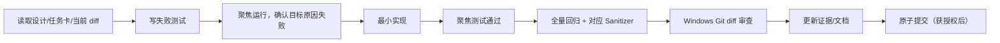

# muduo-chat 实施标准与执行手册

状态：可执行草案  
适用基线：`main` @ `1b94d43`  
上位设计：[EVOLUTION_PLAN.md](EVOLUTION_PLAN.md)  
当前活动任务：无；P1 全部 VERIFIED（Codec/Timer/背压/过载退出/异步日志 + fd 生命周期）；
TSan 全量 73/73 全绿（在案竞态全部关闭）；下一任务 P2-01（ChatApplication 纵向切片）

> 本文描述“如何实施和证明”，不代表其中功能已经完成。任何完成状态必须有当前 checkout、测试输出、diff 和提交记录支持。

## 1. 文档职责与事实优先级

文档按以下顺序使用：

1. `EVOLUTION_PLAN.md`：定义目标架构、模块 interface、阶段依赖和非目标。
2. `IMPLEMENTATION_SOP.md`：定义环境、执行循环、验证闸门和当前任务队列。
3. `docs/tasks/<TASK-ID>.md`：任务启动时创建的执行记录，只记录一个任务。
4. `docs/IMPLEMENTATION_PROGRESS.md`：开始实施后维护的状态索引，不在方案阶段预填“完成”。

发生冲突时，事实优先级为：

```text
可复现测试/原始 benchmark
    > 当前代码与构建配置
    > 已批准的 ADR / 协议 / schema
    > IMPLEMENTATION_SOP
    > EVOLUTION_PLAN
    > README 或历史改进日志
```

旧文档声称“编译通过”不能替代当前 checkout 的 WSL 验证；设计目标不能写入完成进度。

## 2. 已核验的执行环境

核验日期：2026-08-09。

| 项目 | 当前事实 | 验证状态 |
|---|---|---|
| Host | Windows 11 + PowerShell 7 | 当前编辑环境 |
| Linux | Ubuntu 24.04.1 LTS on WSL2 | 已查询 |
| Kernel | `6.6.87.2-microsoft-standard-WSL2` | 已查询 |
| 仓库挂载 | `/mnt/d/agent_learning/muduo-chat` | 已访问 |
| CMake | 3.28.3 | 已执行 `cmake --version` |
| GCC/G++ | 13.3.0 | 已执行 `g++ --version` |
| CTest | `/usr/bin/ctest` | 已查询 |
| pkg-config | `/usr/bin/pkg-config` | 已查询 |
| mysqlclient | 21.2.46；`libmysqlclient-dev` 已安装 | CMake 已发现 |
| GoogleTest | `libgtest-dev` 未安装 | P0-01 前置条件 |
| Clang | 未安装 | fuzz/Clang CI 前置条件，不阻塞 P0-00 |
| Ninja | 未发现 | 非必需；使用默认 Unix Makefiles |

已完成一次隔离目录中的 CMake configure：

```powershell
wsl.exe -d Ubuntu --cd /mnt/d/agent_learning/muduo-chat `
  cmake -S . -B /tmp/muduo-chat-impldoc-019fe5c0 -DCMAKE_BUILD_TYPE=Debug
```

结果：编译器、Threads、PkgConfig 和 mysqlclient 探测成功，生成完成。尚未执行 build/test，不能写成“项目已编译通过”。

### 2.1 WSL 网络提示

每次调用 WSL 会出现 localhost proxy/NAT 提示。它没有阻止本次本地 configure，但任何 `apt`、`FetchContent` 或外部依赖下载都仍属于未验证的网络路径。实现时优先使用系统包和固定版本；需要安装或下载时单独申请授权并记录结果。

## 3. Windows 与 WSL 的职责分工

### 3.1 Windows PowerShell：Git 与文件事实

在换行策略治理前，以下操作以 Windows Git 为准：

- `git status --short --branch`
- `git diff --check`
- `git diff --stat`
- `git diff -- <path>`
- stage/commit（只有用户明确要求时执行）

当前 Windows Git 只显示 `docs/` 为新增；工作树中的既有源码没有本轮修改。

### 3.2 WSL Ubuntu：Linux 构建与执行

以下操作必须在 WSL 完成：

- epoll/eventfd/timerfd/socketpair 相关测试；
- CMake 构建、CTest；
- ASan/UBSan/TSan；
- Linux 进程级集成测试；
- perf、FlameGraph 和正式 benchmark。

### 3.3 换行差异规则

WSL 默认 Git 当前把大量 CRLF 工作树文件识别为修改，而 Windows Git 没有这些修改。`git -c core.autocrlf=true status --short` 在 WSL 中只显示 `docs/`，证明这是 checkout 视图差异，而不是本轮批量改动。

在单独的换行治理提交之前：

- 不在 WSL 执行 stage/commit；
- 不用 WSL 默认 `git status` 判断任务 diff；
- 不运行全仓库换行格式化；
- 不把换行变化混入功能提交；
- 构建验证和 Git 证据分别从 WSL、Windows 收集。

是否增加 `.gitattributes` 并统一 LF 是独立决策，不是 P0-00 的顺手清理。

## 4. 构建目录和工作树保护

### 4.1 当前风险

当前顶层 `CMakeLists.txt` 把可执行文件写到 `${PROJECT_SOURCE_DIR}/bin`，`mymuduo/CMakeLists.txt` 把动态库写到源码目录 `mymuduo/lib`。其中 `mymuduo/lib/libmymuduo.so` 已被 Git 跟踪。

隔离 configure 生成的 `ChatServer.dir/build.make/link.txt` 与 `mymuduo.dir/build.make/link.txt` 也实际引用了上述源码目录输出路径，因此这不是静态阅读推测。

因此在 P0-00 完成前：

- 允许在 `/tmp/...` 执行 CMake configure；
- 禁止执行完整 build，以免覆盖被跟踪的二进制；
- 禁止使用仓库内 `build/` 作为 Agent 验证目录；
- 禁止删除或覆盖现有 `libmymuduo.so`。

### 4.2 P0-00 后的标准构建位置

所有构建写到 WSL ext4 临时目录，避免污染仓库并减少 `/mnt/d` 的小文件 I/O：

```text
/tmp/muduo-chat-build/debug
/tmp/muduo-chat-build/asan
/tmp/muduo-chat-build/tsan
/tmp/muduo-chat-build/release
```

CMake 的 runtime/library/archive 输出必须位于对应 binary tree，例如：

```text
/tmp/muduo-chat-build/debug/bin
/tmp/muduo-chat-build/debug/lib
```

## 5. 单任务执行循环

默认串行执行，任何时刻最多一个任务为 `IN_PROGRESS`。只有用户明确要求并行 Agent 时，才允许把无依赖、写入路径不重叠的任务分派出去；集成和最终验证仍集中完成。

每个任务严格执行：



### 5.1 开始条件

任务开始前必须同时满足：

- 上游任务状态为 `VERIFIED`；
- Windows Git 当前差异已记录，能区分用户改动与任务改动；
- 任务卡明确 interface/可观察行为、允许写入路径和非目标；
- WSL 聚焦验证命令已确定；
- 需要的系统安装、外部下载或 schema 变更已获得相应授权；
- 没有另一个任务处于 `IN_PROGRESS`。

### 5.2 RED 闸门

- 测试必须先因目标行为缺失或 bug 失败。
- 保存聚焦命令、退出码和关键错误。
- 如果测试意外通过，停止实现：要么行为已存在，要么测试没有覆盖目标。
- 对 sanitizer-only bug，可以用稳定复现程序和 sanitizer 报告作为 RED 证据。
- 性能任务用 baseline/profile 和预先定义的门槛替代普通红灯，不先写优化。

### 5.3 GREEN 闸门

- 只实现让目标测试通过的最小代码。
- 不顺手重构、格式化或删除相邻旧代码。
- 新增公开 interface 必须同时写明不变量、线程约束、错误模式和所有权。
- 测试通过 interface 观察结果，不读取私有容器或依赖实现顺序。

### 5.4 回归与证据闸门

根据任务风险选择：

1. 聚焦 CTest。
2. 全量 CTest。
3. ASan+UBSan 或 TSan；两者分开构建。
4. 进程级 integration/fault test。
5. benchmark smoke；只有性能任务运行正式固定环境测量。
6. Windows `git diff --check`、diff stat 和逐文件审查。

没有运行的路径必须写“未验证”，不能由相邻通过项推断。

## 6. 任务卡格式

启动任务时创建 `docs/tasks/<TASK-ID>.md`，使用以下内容，不预先批量创建未来任务卡：

```markdown
# <TASK-ID> <标题>

状态：PLANNED | IN_PROGRESS | RED | GREEN | VERIFIED | BLOCKED
基线：<branch / commit>
依赖：<task ids>
允许写入：<paths>
禁止修改：<paths or scope>

## 问题与证据
<当前代码位置、可复现行为，不写推测>

## Interface / 可观察行为
<调用者需要知道的全部约束>

## 非目标
<本任务明确不做什么>

## RED
命令：<focused command>
预期失败：<reason>
实际证据：<exit code + short output>

## 最小实现
<限定文件和最小策略>

## 验证
- 聚焦：<command/result>
- 回归：<command/result>
- Sanitizer：<command/result or N/A reason>
- Platform：<WSL/CI details>

## Diff 审查
<changed files and why every change belongs>

## 完成定义
<binary checks>

## Commit
<proposed commit message / actual SHA after authorization>
```

状态含义：

- `PLANNED`：尚未写测试。
- `IN_PROGRESS`：已完成基线核对，正在写 RED。
- `RED`：目标失败已复现。
- `GREEN`：聚焦测试通过，但全量闸门未完成。
- `VERIFIED`：所有适用闸门通过且 diff 已审查。
- `BLOCKED`：重复确认同一外部阻碍后无法继续；记录所需输入，不把困难当阻塞。

## 7. 标准 WSL 验证命令

以下命令从 PowerShell 执行；P0-00 完成前只运行 configure。

### 7.1 Debug

```powershell
wsl.exe -d Ubuntu --cd /mnt/d/agent_learning/muduo-chat `
  cmake --fresh -S . -B /tmp/muduo-chat-build/debug `
  -DCMAKE_BUILD_TYPE=Debug -DENABLE_TESTS=ON

wsl.exe -d Ubuntu -- `
  cmake --build /tmp/muduo-chat-build/debug --parallel

wsl.exe -d Ubuntu -- `
  ctest --test-dir /tmp/muduo-chat-build/debug --output-on-failure
```

### 7.2 聚焦测试

```powershell
wsl.exe -d Ubuntu -- `
  ctest --test-dir /tmp/muduo-chat-build/debug `
  -R 'Buffer|EventLoop|TcpConnection' --output-on-failure
```

正则以单引号包裹，避免 PowerShell 提前处理。

### 7.3 ASan + UBSan

```powershell
wsl.exe -d Ubuntu --cd /mnt/d/agent_learning/muduo-chat `
  cmake --fresh -S . -B /tmp/muduo-chat-build/asan `
  -DCMAKE_BUILD_TYPE=Debug -DENABLE_TESTS=ON `
  '-DCMAKE_CXX_FLAGS=-fsanitize=address,undefined -fno-omit-frame-pointer' `
  '-DCMAKE_EXE_LINKER_FLAGS=-fsanitize=address,undefined' `
  '-DCMAKE_SHARED_LINKER_FLAGS=-fsanitize=address,undefined'

wsl.exe -d Ubuntu -- `
  cmake --build /tmp/muduo-chat-build/asan --parallel

wsl.exe -d Ubuntu -- `
  ctest --test-dir /tmp/muduo-chat-build/asan --output-on-failure
```

### 7.4 TSan

```powershell
wsl.exe -d Ubuntu --cd /mnt/d/agent_learning/muduo-chat `
  cmake --fresh -S . -B /tmp/muduo-chat-build/tsan `
  -DCMAKE_BUILD_TYPE=Debug -DENABLE_TESTS=ON `
  '-DCMAKE_CXX_FLAGS=-fsanitize=thread -fno-omit-frame-pointer' `
  '-DCMAKE_EXE_LINKER_FLAGS=-fsanitize=thread' `
  '-DCMAKE_SHARED_LINKER_FLAGS=-fsanitize=thread'

wsl.exe -d Ubuntu -- `
  cmake --build /tmp/muduo-chat-build/tsan --parallel

wsl.exe -d Ubuntu -- `
  ctest --test-dir /tmp/muduo-chat-build/tsan `
  -L concurrency --output-on-failure
```

ASan 与 TSan 不混在同一 binary tree。若 TSan 在 WSL 内核上出现运行时自身不兼容，必须保存原始错误并转移到 Linux CI/裸机验证，不能标记通过。

### 7.5 Windows Git 审查

```powershell
git status --short --branch
git diff --check
git diff --stat
git diff -- <task-files>
```

构建前后都执行一次；新增未跟踪文件需显式列出，因为普通 `git diff` 不展示它们。

## 8. 测试依赖策略

P0-01 采用 CTest + GoogleTest，GoogleTest 作为开发依赖，不链接进生产库。当前 WSL 未安装 `libgtest-dev`。

实施时优先走 Ubuntu 系统包，避免每次 configure 联网下载：

```powershell
wsl.exe -d Ubuntu -- sudo apt-get update
wsl.exe -d Ubuntu -- sudo apt-get install -y libgtest-dev
```

这些命令会修改 WSL 系统并访问网络，执行前必须单独获得用户批准。若网络或证书阻止安装，停止 P0-01 并记录，不临时复制未知来源测试框架。

CMake 中使用 `find_package(GTest CONFIG REQUIRED)`；不要同时维护“系统包 + 未固定 FetchContent fallback”两条不可重复的依赖路径。CI 也安装相同系统包。

## 9. P0 可执行队列

P0 的任务顺序固定如下：

```text
P0-00 构建产物隔离
  -> P0-01 CMake/CTest 测试骨架
  -> P0-02 网络特征测试
  -> P0-03 跨线程 send/close 生命周期修复
  -> P0-04 可复现 benchmark 基线
```

### 9.1 P0-00 构建产物隔离

状态：`PLANNED`，下一任务。

**目的**

使 out-of-source build 的全部产物留在 binary tree，构建前后源码工作树不新增、不覆盖文件。

**允许修改**

- `/CMakeLists.txt`
- `/mymuduo/CMakeLists.txt`
- `/.gitignore`
- 删除已跟踪生成物 `/mymuduo/lib/libmymuduo.so`
- `/docs/tasks/P0-00.md`
- `/docs/IMPLEMENTATION_PROGRESS.md`（开始实施时创建）

**禁止修改**

- 所有 `.cc/.cpp/.h/.hpp` 源码；
- 业务行为、编译 flags、C++ 标准；
- 与换行/格式化相关的全仓库文件；
- 任何测试框架或产品功能。

**失败观察**

当前 CMake 明确设置源码目录输出，且 `.so` 已被 Git 跟踪。RED 应通过一个临时 build 验证目标输出指向 source tree；不要为了复现而覆盖现有 `.so`。

**最小实现**

- 顶层统一设置 `CMAKE_RUNTIME_OUTPUT_DIRECTORY`、`CMAKE_LIBRARY_OUTPUT_DIRECTORY`、`CMAKE_ARCHIVE_OUTPUT_DIRECTORY` 到 `${CMAKE_BINARY_DIR}` 下；
- 删除子目录对 `${PROJECT_SOURCE_DIR}/lib` 的覆盖；
- 停止跟踪生成的 `.so`，并精确忽略对应生成目录/文件；
- 不顺手现代化整个 CMake。

**验证**

1. Windows 记录修改前 status。
2. WSL 使用 `/tmp/muduo-chat-build/p0-00` configure + build。
3. 确认 ChatServer/ChatClient/libmymuduo 全在 binary tree。
4. Windows status 中只出现允许修改集合。
5. 第二次 build 为增量成功，不向源码目录写入新产物。

**完成定义**

- clean checkout 构建不改变源码工作树；
- tracked binary 被移除且有明确 ignore；
- configure/build 在当前 WSL 成功；
- 无测试功能或源码行为改动。

**提交边界**

建议提交：`build: keep generated artifacts out of source tree`。

### 9.2 P0-01 CMake/CTest 测试骨架

依赖：P0-00 `VERIFIED`，GoogleTest 安装已获授权并完成。

**Interface / 可观察行为**

- `ENABLE_TESTS=ON`：发现 GoogleTest、构建并注册 tests。
- `ENABLE_TESTS=OFF`：生产构建不要求 GoogleTest。
- 默认值为 ON 还是 OFF 必须在任务卡中作出单一决定；建议顶层开发 checkout 为 ON、发行构建显式 OFF。

**RED**

添加最小 `BufferTest` 并运行 CTest，证明当前没有测试目标。

**最小实现**

- `include(CTest)`；
- `tests/CMakeLists.txt`；
- `tests/unit/BufferTest.cpp`；
- 只增加构建测试所需 include/link seam，不移动生产源码。

**完成定义**

- 无 MySQL server 也能运行 unit label；
- `ctest -N` 能列出测试；
- ENABLE_TESTS=OFF 的 ChatServer 构建成功；
- Debug 全量 CTest 通过。

**提交边界**

`test: establish ctest and gtest baseline`。

### 9.3 P0-02 网络特征测试

依赖：P0-01 `VERIFIED`。按以下子步骤分别提交，不能把所有网络类一次覆盖：

1. `P0-02A Buffer contract`
   - append/retrieve/compact/grow；
   - `readv` 内部区、extra buffer 和 EOF/error；
   - 不为测试暴露私有索引。
2. `P0-02B EventLoop contract`
   - 同线程 `runInLoop`；
   - 跨线程 `queueInLoop` wakeup；
   - 跨线程 `quit`；
   - 回调恰好一次。
3. `P0-02C EventLoopThreadPool contract`
   - 0 worker 返回 base loop；
   - N worker round-robin；
   - start/stop 生命周期不悬空。
4. `P0-02D TcpConnection characterization`
   - connect/close 回调；
   - 单线程完整 send；
   - output Buffer 排空后的 write-complete。

此任务锁定当前正确行为。若测试暴露独立 bug，为该 bug 新建任务，不把大范围修复混入 characterization commit。

### 9.4 P0-03 跨线程 send/close 生命周期修复

依赖：P0-02D `VERIFIED`。

**问题证据**

当前非 loop 线程路径把裸 `this`、`message.data()` 和 `message.size()` 放入延迟回调；函数返回后消息存储和连接对象都可能失效。`shutdownInLoop` 同样通过裸 `this` 排队。

**Interface / 可观察行为**

- P0 阶段保持现有 `void send` 业务语义，不提前引入 P1 的 `SendResult`；
- 跨线程发送必须拥有 payload，不能依赖调用者生命周期；
- 排队回调持有连接到执行结束；
- shutdown/close 幂等，callback 不重复；
- 所有 Channel 操作仍在所属 EventLoop。

**RED**

- `socketpair` + 独立 EventLoop thread；
- 非 loop 线程发送临时大字符串后立即释放；
- send 与 close/shutdown 交错重复 10000 次；
- ASan/TSan 至少有一个稳定证据路径，测试不靠固定 sleep 猜时序。

**最小实现**

- `send(std::string message)` 按值拥有数据；
- queue closure 捕获 `shared_from_this()` 和移动 payload；
- `shutdown` 排队时捕获 self；
- 不同时实现背压、Timer 或通用 Executor。

**完成定义**

- 聚焦测试、全量测试、ASan+UBSan 通过；
- TSan 路径通过或有明确平台限制和 CI 后续验证；
- callback 次数与 payload 完整性可断言；
- diff 只涉及 TcpConnection、对应测试和任务证据。

**提交边界**

`fix(net): own queued connection operations`。

### 9.5 P0-04 可复现 benchmark 基线

依赖：P0-03 `VERIFIED`。

只建立测量能力，不在同一任务优化网络库：

- `tools/chat-bench` 支持 connect、echo、slow-consumer；
- 固定 workload 配置和 JSON 结果 schema；
- 记录 commit、编译 flags、CPU、kernel、ulimit、payload、连接数、持续时间；
- 单元测试 percentile/schema；
- smoke 只检查工具工作，正式数字只来自固定环境重复测量。

完成后生成第一份 `docs/performance-reports/<commit>.md`，其中所有数字标记 WSL2 环境，不能外推为裸 Linux 生产性能。

## 10. P0 完成闸门

只有以下全部满足，P1-01 Codec 才能开始：

- build 产物完全隔离；
- Debug CTest 可复现；
- Buffer/EventLoop/ThreadPool/TcpConnection 基线有 interface 测试；
- 已知跨线程 send/shutdown 生命周期风险有回归测试并修复；
- ASan+UBSan 通过；
- TSan 已在 WSL 或 Linux CI 给出可定位结论；
- benchmark 工具能输出带环境元数据的结果；
- Windows Git diff 无无关格式化或用户文件覆盖；
- `IMPLEMENTATION_PROGRESS.md` 中每个完成项都有命令和 commit/evidence。

P0 不包括 Codec、TimerQueue、背压、多 Reactor、Redis、Kafka 或业务重构。

## 11. 后续阶段进入规则

后续任务的详细行为以 `EVOLUTION_PLAN.md` 为准，实施时仍逐项生成任务卡：

| 阶段 | 首任务 | 进入条件 | 严禁抢跑 |
|---|---|---|---|
| P1 网络内核 | P1-01 StreamCodec | P0 全部 VERIFIED | io_uring、内存池、全仓 C++20 改写 |
| P2 应用内核 | P2-01 ChatApplication 注册切片 | Codec/Timer/背压对应闸门通过 | 直接开启多 Reactor、一次性重写 ChatService |
| P3 可靠消息 | P3-01 schema/outbox | 阻塞 DB 已移出 EventLoop | Kafka 先行、删除旧离线表 |
| P4 多节点 | P4-01 Presence fencing | ACK/幂等/顺序单机验证完成 | Redis Pub/Sub 充当可靠消息终态 |
| P5 性能实验 | 由 profile 选题 | 固定 baseline 和瓶颈证据 | 为展示而写 lock-free/io_uring/内存池 |

## 12. 停止和升级条件

遇到以下情况立即停止当前任务并报告，不猜测扩展范围：

- 当前 diff 包含不属于任务的用户改动且无法隔离；
- 测试无法稳定复现目标 bug；
- 需要安装软件、访问网络、修改数据库数据或删除材料但未授权；
- WSL 与 Linux CI 行为冲突；
- interface 必须改变，且会影响两个以上后续模块；
- benchmark 没有固定环境或原始结果；
- 同一阻碍重复出现并确实无法在现有权限内推进。

发现无关 bug时记录路径和证据，但不在当前任务顺手修复。

## 13. 下一步

若用户授权开始实施，唯一下一步是：

1. 创建 `docs/tasks/P0-00.md` 和 `docs/IMPLEMENTATION_PROGRESS.md`；
2. 记录 Windows Git baseline；
3. 为“构建不得写入 source tree”建立 RED 证据；
4. 仅修改 P0-00 允许路径；
5. 在 WSL 完成 configure/build，在 Windows 完成 diff 审查；
6. 交付结果，获得授权后再提交并进入 P0-01。

没有用户授权时，本文件本身不会触发代码修改、依赖安装、删除已跟踪二进制或 Git 提交。
