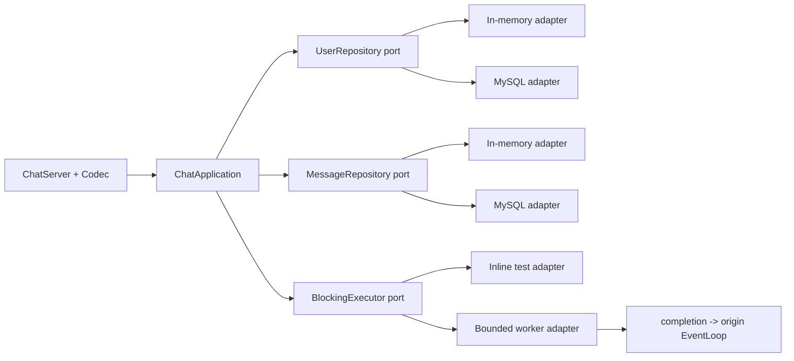

# P1 收口整改与后续推进计划

计划基线：`main` @ `00db852`

状态：`PLANNED`

审查输入：[P1_COMPLETION_REVIEW_00db852.md](P1_COMPLETION_REVIEW_00db852.md)

上位设计：[EVOLUTION_PLAN.md](EVOLUTION_PLAN.md)

## 1. 执行决定

当前不直接进入原定 P2-01。先串行完成 P1R-00 至 P1R-09，重新通过 P1 完成性审查，再进入 P2。

原因不是“测试不够多”，而是已有几个接口无法表达或约束其承诺的行为：

- `SendResult` 没有区分“本条已接收但应暂停”和“本条因容量被拒绝”。
- output buffer 之外的跨线程 pending send 不在 hard budget 内。
- `forceClose()` 没有隐藏 EventLoop 线程亲和性。
- `void encode(...)` 无法返回超限或非法帧错误。
- P1-05 的任务卡范围与上位设计不一致。

执行规则：任一时刻只有一个任务为 `IN_PROGRESS`；每个行为任务必须保留 RED、聚焦 GREEN、全量回归、Sanitizer、diff 审查和原子提交证据。P1R-00 属于纯证据修复，不伪造历史 RED。

## 2. P1R：P1 完成性收口

### P1R-00 恢复事实、任务状态与审计边界

- 接口/可观察行为：进度表、SOP、任务卡对当前 HEAD 给出同一个状态；P1 明确为 `REMEDIATION`，不能再显示“已完成且下一步 P2”。
- RED/基线证据：保存当前 `P1-06A IN_PROGRESS`、`P1-07 待提交`、进度表 `VERIFIED`、`git diff --check` 失败和过期 `CLAUDE.md` 的输出。该任务不补造历史失败测试。
- 最小修改：只修正文档状态、out-of-source 构建命令、测试/Sanitizer 入口和本计划链接；不重写已提交的历史证据。
- 验证：`rg -n 'IN_PROGRESS|待提交|下一任务' docs CLAUDE.md`；`git diff --check`；逐文件核对状态唯一性。
- 完成定义：只有 P1R-00 为 `IN_PROGRESS/VERIFIED`；所有历史偏差仍可从 Git 和审查报告定位；diff 无空白错误。
- 提交边界：仅文档，建议提交 `docs: reopen P1 after completion review`。

### P1R-01 让测试链接真实生产目标

- 接口/可观察行为：网络库对象代码只由 `mymuduo` target 编译一次；相关单元/集成测试链接这个 target，使用与生产一致的语言标准、宏和 sanitizer flags。
- 失败测试：生成 `compile_commands.json`，增加 CMake/脚本检查；当前生产 `.cc` 同时出现在 `mymuduo` 和多个 test target 时失败。
- 最小实现：调整 `tests/CMakeLists.txt` 的 source/link 列表；测试 helper 保留在 test target，不为测试暴露生产私有成员。
- 验证：全新 Debug configure/build；检查 compile database；运行 78 项回归；再跑 ASan+UBSan 与 TSan。
- 完成定义：生产 `.cc` 不被测试目标重复编译；现有测试数量和行为不回退；`ENABLE_TESTS=OFF` 仍不依赖 GoogleTest。
- 提交边界：CMake 与必要的 test helper，建议提交 `test: exercise the production mymuduo target`。

### P1R-02 收紧 Codec 与输出编码契约

- 接口/可观察行为：编码返回显式 `EncodeResult`；encoder 从 body 计算 header 长度，不信任调用方填写的 body length；超过 16 MiB、非法 version/flags/content type 时不会产生输出字节。
- 接口选择：把现有回调深化为小型 `OutputCodec` 接口，至少提供 `encodedSize(payloadBytes)` 与 `encode(payload, output) -> EncodeResult`。只保留两个真实 adapter：Legacy JSON line 与 Binary v2；不建立第三个抽象层。
- 失败测试：16 MiB 边界、上限+1、header/body length 不一致、非 JSON content type、非法 flags/version；协议错误连接必须释放而不是只 half-close。
- 最小实现：修改 `StreamCodec`/两个 codec adapter 和 ChatServer 组装；协议错误转入线程安全的 force-close 请求。
- 验证：`ctest -R 'StreamCodec|LegacyJsonLineCodec|BinaryFrameCodec|OutputEncoder' --output-on-failure`；全量 Debug/ASan；随机分片风暴。
- 完成定义：任何可编码消息都有可预知的准确帧大小；编码失败不修改 output；decode/encode 上限一致；v1/v2 业务结果仍等价。
- 提交边界：codec、组装与对应测试，建议提交 `fix(codec): reject invalid and oversized output frames`。

### P1R-03 建立真正有界、无歧义的发送准入

- 接口/可观察行为：发送结果同时表达“本条是否已接收”和“生产者是否应暂停”，不能再靠一个 `Backpressured` 枚举猜测是否需要重试。
- 建议接口：`SendOutcome { disposition, pressure }`；`disposition` 至少包含 `Accepted / WouldBlock / Closed / TooLarge`，`pressure` 为 `Normal / PauseProducer`。若保持 enum，则必须等价表达 `AcceptedBackpressured` 与 `WouldBlock` 两种不同状态。
- 预算规则：连接级原子 outstanding budget 覆盖 pending send、编码后的帧和 output buffer 中尚未写出的全部字节；成功写出或丢弃时释放预算。准入使用准确 frame size，并在入队前完成 CAS reservation。
- 失败测试：非 loop 线程持续发送且 loop 暂停消费，证明 outstanding bytes 与 pending send count 不越 hard limit；跨 pause 的本条消息结果无歧义；恢复回调只触发一次；关闭时预算归零；零长度小消息不能绕过任务数上限。
- 最小实现：新增一个连接内预算组件和一个 low-water/resume 通知；不把全局通用队列框架混入本任务。
- 验证：`ctest -R 'Backpressure|TcpConnection' --repeat until-fail:20 --output-on-failure`；ASan+UBSan；TSan；slow-consumer 进程 smoke。
- 完成定义：任何线程调用 `send` 都不能让连接已接收但未写出的内存超过 hard budget；消费者能够根据公开结果无重复、无丢失地停产和恢复。
- 提交边界：TcpConnection、最小 encoder 接口联动和测试，建议提交 `fix(net): bound queued and buffered writes`。

### P1R-04 将连接关闭收进所属 EventLoop

- 接口/可观察行为：公开 `forceClose()` 可从任意线程调用；所有 Channel/fd/callback 状态变更只在 connection 所属 loop 执行；内部 `forceCloseInLoop()` 保持私有。
- 失败测试：`TcpServer` 使用至少 2 个 worker loops 建立多连接，从 base loop 发起 drain/force close；当前实现应由线程断言或 TSan 暴露跨线程访问。
- 最小实现：`forceClose()` 通过 `queueInLoop` 调度并捕获 `shared_from_this()`；server 只快照连接并调用线程安全入口；清理 stall timer 与预算。
- 验证：`ctest -R 'TcpServer|TcpConnection|Backpressure'`；TSan 重复 20 轮；进程级 pending-write 退出测试。
- 完成定义：worker-loop 场景无 TSan 报告；close callback 恰好一次；重复 shutdown/forceClose 幂等；连接和 timer 均释放。
- 提交边界：TcpConnection/TcpServer 与测试，建议提交 `fix(net): marshal forced close to the owner loop`。

### P1R-05 修复信号通知与进程退出生命周期

- 接口/可观察行为：SIGINT/SIGTERM handler 永不阻塞；重复/突发信号只合并为退出请求；drain 完成或硬截止后进程退出且关闭 self-pipe fd。
- 失败测试：测试子进程先通过测试 seam 将通知 socket 写满到 `EAGAIN`，再发送一次真实信号并设置总超时；同时检查写端 flags，验证重复信号不会启动多套 drain timer。
- 最小实现：创建时为 socketpair 两端设置 `O_NONBLOCK | FD_CLOEXEC`，handler 对 `EAGAIN` 静默丢弃通知；loop 回调 drain 所有字节并幂等启动退出流程。
- 验证：新增 process CTest；循环 SIGINT/SIGTERM；Debug/ASan/TSan；检查退出码、最大耗时与 fd 泄漏。
- 完成定义：handler 只调用 async-signal-safe 操作且无阻塞路径；DRAINED 与 5 秒 hard deadline 两条路径都有进程证据。
- 提交边界：main、process test 与任务证据，建议提交 `fix(server): make signal wakeups nonblocking and idempotent`。

### P1R-06 补齐 accept 过载与 EMFILE 恢复

- 接口/可观察行为：一个 `OverloadPolicy` 统一给出 `maxConnections`、accept token rate/burst、单连接 pending-send task cap；拒绝原因有独立计数。控制面任务不得因数据面满而被丢弃。
- EMFILE 行为：Acceptor 持有 `/dev/null` idle fd；耗尽时关闭 idle fd、accept 并关闭一个已排队连接、重新打开 idle fd，再按定时器退避恢复监听。
- 失败测试：在子进程降低 `RLIMIT_NOFILE` 后真实耗尽 fd；注入 clock 验证 token bucket；reconnect storm 下已有连接仍可收发；数据面任务队列上限不能阻止 force-close/quit。
- 最小实现：在 Acceptor/TcpServer 附近实现策略，不引入 Redis 或分布式限流；与 P1R-03 的 pending-send 计数复用同一事实源。
- 验证：`ctest -R 'Acceptor|TcpServer|Overload'`；fd-exhaustion process CTest；reconnect storm smoke；ASan/TSan。
- 完成定义：连接数、accept rate、pending-send 三类过载均为 fail-fast 且可观察；EMFILE 后服务可恢复；已有连接不被新连接风暴拖垮。
- 提交边界：OverloadPolicy、Acceptor/TcpServer、指标计数和测试，建议提交 `feat(net): enforce accept and fd-exhaustion policy`。

### P1R-07 修复 TimerQueue 的取消与相位契约

- 接口/可观察行为：默认、已取消和已触发的 `TimerId` 取消均为幂等 no-op；重复 timer 以 planned deadline 推进，不按 callback 完成时刻永久漂移。
- 调度策略：明确采用“跳过已经错过的周期，不并发补跑；下一 deadline 是首个严格晚于当前时刻的 planned phase”。
- 失败测试：`cancel(TimerId{})`；回调中重复取消；长回调跨过多个 interval；同 deadline 顺序；跨线程取消；loop 退出。
- 最小实现：先做 null/active 判断；重复 timer 根据前一 planned deadline 计算下一相位；回调完成后读取新 `now` 再 arm timerfd。
- 验证：`ctest -R TimerQueue --repeat until-fail:20`；TSan；不读取 TimerQueue 私有容器。
- 完成定义：无空指针、无重复回调、长期相位误差不随回调次数线性累积；测试使用可控 clock/调度函数而不是固定 sleep 猜时序。
- 提交边界：Timer/TimerQueue 与测试，建议提交 `fix(timer): preserve repeat phase and make cancel idempotent`。

### P1R-08 完成最小结构化异步日志模块

- 接口/可观察行为：日志事件至少包含 timestamp、level、thread id、component、event name、message；context 在入队前固定，消费端不重新读取调用线程状态。
- 失败测试：多线程 context 不串扰；队列满的 drop policy；FATAL 必达与 flush；正常退出 flush；滚动边界；批量写不改变事件顺序。
- 最小实现：`LogEvent` 值对象、有限队列和批量 sink；单消费者按 batch 写，移除逐条强制 flush。只实现一个文件/标准错误生产 sink 与一个 test recorder adapter。
- 性能证据：同一硬件、同一消息大小和线程数，对比同步/异步吞吐、p50/p95/p99 调用时延、drop count 与 CPU；保存原始参数和报告，不预设提升比例。
- 验证：`ctest -R Logger --repeat until-fail:20`；ASan/TSan；独立 logger benchmark。
- 完成定义：结构化字段可由 test recorder 断言；FATAL 不丢；正常退出不丢已接收事件；异步模式没有未解释的性能回退。
- 提交边界：Logger、sink adapter、测试与性能报告，建议提交 `feat(log): batch structured events asynchronously`。

### P1R-09 P1 独立完成性验收

- 接口/可观察行为：此任务不实现新功能，只验证 P1 承诺和证据一致。
- RED/基线证据：逐项回看审查报告 S-01 至 S-07、F-01 至 F-06、A-01 至 A-03；任何一项缺证据即保持 P1 未完成。
- 验证矩阵：全新 Debug、ASan+UBSan、TSan、Release tests-off；每套从 configure 开始；Debug/TSan 至少重复关键并发套件 20 轮。
- 进程矩阵：v1/v2 等价、slow consumer、2-worker-loop drain、SIGINT/SIGTERM 风暴、fd exhaustion、reconnect storm、日志正常/FATAL 退出。
- 文档检查：`git diff --check`；任务状态唯一；任务卡含 RED/GREEN 原始命令、退出码、失败原因和提交；设计契约不再迁就实现偏差。
- 完成定义：两轴重新审查均无 P0/P1/High/Medium 未决项；才将 P1 标为 `VERIFIED` 并允许 P2-00 开始。
- 提交边界：只提交证据、报告与状态更新，建议提交 `docs: verify P1 remediation gates`。

## 3. P1R 全局闸门

每个任务执行以下最小闭环：

1. 固定 HEAD、确认上游 `VERIFIED`、确认工作树与唯一活动任务。
2. 写公开接口测试并运行，记录预期失败、实际失败和退出码。
3. 只做让目标测试通过的最小实现。
4. 聚焦测试、Debug 全量、适用 Sanitizer、进程 smoke。
5. `git diff --check`、`git diff --stat`、逐文件审查，确认没有无关清理。
6. 更新任务卡和进度表，再做一个原子提交。

禁止用已有 78/78 结果替代新增失败测试；禁止把未运行的 MySQL、fd、信号或 worker-loop 路径写成已验证。

## 4. P2：应用边界、持久化与多 Reactor

P2 的目标不是“先把 threadNum 改大”，而是先让 EventLoop 不再执行阻塞数据库工作。只有仓储和阻塞任务边界稳定，才允许开启多 Reactor。

### P2-00 固化领域词汇与现有行为

- 接口/行为：列出 Command、Reply、Session、User、Friendship、Group、Message、Delivery 的定义、标识和错误分类；不让 JSON 字段名直接充当领域模型。
- 失败测试：为注册、登录、重复登录、登出、好友、群组、单聊、离线消息建立 characterization 表；缺失或互相矛盾的行为先失败。
- 最小实现：只新增领域词汇/行为矩阵和测试 fixture，不迁移生产用例。
- 验证命令：`ctest --test-dir /tmp/muduo-chat-build/debug -R 'DomainCharacterization|DualProtocol' --output-on-failure`。
- 完成定义：v1/v2 对同一矩阵结果一致；每条行为能定位到当前代码或明确标为待决 ADR。
- 提交：`test(domain): characterize chat use cases`。

### P2-01 建立 `ChatApplication` 首个纵向切片

- 接口/行为：`handle(SessionContext, Command, Reply)` 处理注册；网络层只转换 codec 与 session，不知道 MySQL 类型。
- 失败测试：成功、重名、非法输入、repository failure/timeout，全程不启动网络或数据库。
- 最小实现：`UserRepository` port、in-memory adapter、注册用例；旧入口仅委托新应用接口。
- 验证命令：`ctest --test-dir /tmp/muduo-chat-build/debug -R 'ChatApplicationRegistration|DualProtocol' --output-on-failure`。
- 完成定义：接口测试全绿，v1/v2 注册 smoke 不变；先以 in-memory adapter 与委托现有 `UserModel` 的 legacy production adapter 形成真实 seam，P2-02 再替换为直接 MySQL adapter。
- 提交：`feat(app): add registration vertical slice`。

### P2-02 实现安全的 MySQL `UserRepository`

- 接口/行为：prepared statements、事务边界、唯一键冲突、断线与 timeout 映射为稳定领域错误；业务层不接触 `MYSQL*`。
- 失败测试：引号、NUL、emoji、超长输入、唯一键竞争、断线、超时；从空 schema 运行 migration。
- 最小实现：MySQL RAII statement/transaction adapter 和配置注入；不同时迁移好友/消息表。
- 验证命令：`ctest --test-dir /tmp/muduo-chat-build/debug -R 'UserRepositoryContract|MySQLUserRepository' --output-on-failure`。
- 完成定义：repository contract 对 in-memory/MySQL adapter 共用；真实 MySQL integration 必跑，不把未配置造成的 skip 算通过。
- 提交：`feat(storage): implement mysql user repository`。

### P2-03 建立有界 `BlockingExecutor`

- 接口/行为：`submit(task, completion) -> SubmitResult`；有队列容量、worker 数、提交拒绝、任务 deadline；completion 必须回到原 EventLoop。
- 失败测试：慢任务不阻塞 loop probe；队列满 fail-fast；连接关闭后 completion 不访问旧 session；shutdown 有界。
- 最小实现：一个有界 worker adapter 和一个 inline test adapter；不创建通用 future 框架。
- 验证命令：Debug/ASan/TSan 分别执行 `ctest --test-dir <build-dir> -R 'BlockingExecutor|EventLoopResponsiveness' --output-on-failure`。
- 完成定义：慢 DB adapter 下 EventLoop 定时探针仍满足预先记录的延迟门槛；ASan/TSan 无生命周期问题。
- 提交：`feat(app): isolate blocking work behind a bounded executor`。

### P2-04 连接池 timeout、RAII 与关闭

- 接口/行为：`acquire(deadline) -> Lease/PoolError`；Lease 析构归还；池关闭后 acquire 失败；不允许无限等待。
- 失败测试：池耗尽 timeout、并发归还、坏连接替换、数据库断线、shutdown 时有等待者。
- 最小实现：固定 min/max 与 acquire timeout；暂不做未经 benchmark 的动态扩缩容。
- 验证命令：`ctest --test-dir /tmp/muduo-chat-build/debug -R 'ConnectionPool|MySQLPoolIntegration' --output-on-failure`，并在 TSan build 重跑 `ConnectionPool`。
- 完成定义：TSan、MySQL integration、进程退出无挂死；pool 指标可读取。
- 提交：`fix(storage): bound connection-pool acquisition`。

### P2-05 迁移用户与会话用例

- 接口/行为：登录、登出、连接断开、在线状态更新通过 `ChatApplication`；session generation 防止旧 completion 写入重连后的 session。
- 失败测试：重复登录、快速断开/重连、DB timeout、旧异步 completion、服务退出清理。
- 最小实现：按注册、登录、登出顺序逐个迁移；每个用例单独提交，不同时改协议。
- 验证命令：`ctest --test-dir /tmp/muduo-chat-build/debug -R 'SessionApplication|Login|Logout|Disconnect' --output-on-failure`，并运行慢 DB 的 EventLoop probe。
- 完成定义：旧 `ChatService` 对这些用例只做适配；没有 EventLoop 内同步 SQL。
- 提交：每个用例一个 `refactor(app): migrate ... use case`。

### P2-06 迁移好友与群组用例

- 接口/行为：FriendRepository、GroupRepository 返回领域对象/错误；事务边界在 adapter 内，由应用层选择用例编排。
- 失败测试：重复添加、目标不存在、并发加入、部分事务失败、权限错误。
- 最小实现：先 in-memory contract，再 MySQL adapter，再迁移入口。
- 验证命令：`ctest --test-dir /tmp/muduo-chat-build/debug -R 'FriendRepositoryContract|GroupRepositoryContract|FriendApplication|GroupApplication' --output-on-failure`。
- 完成定义：两套 adapter 共用契约；网络/codec 测试不依赖数据库。
- 提交：好友与群组分别提交。

### P2-07 迁移消息与离线消息用例

- 接口/行为：MessageRepository 只负责当前单机的存取，不提前加入分布式 ACK/outbox；Reply 明确“当前服务器已接受”而不是“对端已收到”。
- 失败测试：目标在线/离线、保存失败、重复请求、连接在 completion 前关闭、群组部分成员离线。
- 最小实现：in-memory contract、MySQL adapter、单聊后群聊；可靠消息留给 P3。
- 验证命令：`ctest --test-dir /tmp/muduo-chat-build/debug -R 'MessageRepositoryContract|DirectMessageApplication|GroupMessageApplication|OfflineMessage' --output-on-failure`。
- 完成定义：EventLoop 无同步 SQL；当前语义在文档中与 P3 目标语义分开。
- 提交：单聊、群聊、离线读取分别提交。

### P2-08 激活多 Reactor

- 前置：P2-01 至 P2-07 全部 `VERIFIED`，代码扫描与运行探针证明 EventLoop 没有阻塞 SQL/连接池等待。
- 失败测试：2/4 loops 并发登录、聊天、断开；同用户跨 loop 重连；server drain；回调线程归属断言。
- 最小实现：配置化 `threadNum`，session registry 做明确分片/同步；不同时引入 RPC 或多进程。
- 验证命令：Debug/TSan 分别执行 `ctest --test-dir <build-dir> -R 'MultiReactor|ServerDrain|SessionReconnect' --repeat until-fail:20 --output-on-failure`。
- 完成定义：1/2/4 loops 的正确性与 TSan 全绿；性能曲线有原始报告，不要求预设线性加速。
- 提交：`feat(net): enable multi-reactor after blocking isolation`。

### P2-09 配置与依赖关闭顺序

- 接口/行为：v1/v2 port、thread count、DB 地址/凭据、pool/executor 容量从配置加载；无源码默认密码；端口冲突启动失败并给出明确错误。
- 失败测试：缺项、非法值、v1/v2 同端口、SIGTERM 时 executor/pool 尚有任务、配置不泄露 secret。
- 最小实现：一个只读配置对象和环境变量/file adapter；不引入远程配置中心。
- 验证命令：`ctest --test-dir /tmp/muduo-chat-build/debug -R 'Config|DependencyShutdown|SignalShutdownProcess' --output-on-failure`。
- 完成定义：启动校验 fail-fast；关闭顺序为 stop accept → drain network → stop submissions → drain/cancel executor → close pool → quit loops。
- 提交：`feat(server): validate runtime configuration and shutdown dependencies`。

### P2-10 M2 独立验收

- 矩阵：in-memory unit、MySQL integration、v1/v2 process、慢 DB、DB down、1/2/4 loops、Debug/ASan/TSan、Release。
- 性能：同一环境记录 1/2/4/8 loops 的吞吐、p50/p95/p99、EventLoop lag、DB pool wait、executor queue/drop；不把单机结果外推为生产容量。
- 验证命令：每套全新 build 执行 `ctest --test-dir <build-dir> --output-on-failure`，Release 另执行 `-DENABLE_TESTS=OFF` 构建；MySQL process suite 不得 skip。
- 完成定义：所有阻塞 DB 路径在 executor；应用测试不依赖网络；adapter contract 共用；多 Reactor 正确性与关闭路径有证据。
- 提交：仅报告、状态与必要文档，`docs: verify M2 application and reactor gates`。

## 5. P3 至 P5 的阶段队列

以下是带验收门槛的阶段队列，不是立刻编码的任务卡。P2 完成后必须根据稳定的领域模型重新拆卡；现在提前固定类名、线程数或中间件参数会制造无证据约束。

### P3 可靠消息语义

1. 先写 ADR：区分 request id、message id、conversation sequence、server accepted、persisted、delivered、client ACK。
2. 设计 migration：Conversation、Message、Delivery、Outbox；验证空库升级、旧数据升级和回滚。
3. 实现“持久化 + 幂等接受”事务；回复丢失后同 request 重试不重复建消息。
4. 实现离线投递、ACK、超时重试和重连续传；重复 ACK 幂等。
5. 实现 conversation 内 sequence；定义多 producer 下的排序边界。
6. 故障注入：事务每一步失败、accept 回复丢失、ACK 丢失、进程重启。

M3 闸门：数据库状态机可由集成测试观察；同一 request 不产生两个 message；至少一次投递下业务去重成立；不宣称端到端 exactly-once。

### P4 集群化

1. Redis presence 使用 session generation/fencing token；旧节点延迟下线不能删除新会话。
2. Transactional outbox relay 发布到消息总线；覆盖 commit 后/发布前 crash 与发布后/标记前 crash。
3. Gateway 根据 presence 定向投递；节点失效、网络分区和重连到新节点可恢复。
4. 只有进程边界稳定后才引入 RPC；单体内调用不为“微服务”提前包装 RPC。
5. 两节点 chaos：Redis timeout/down、broker 重复/延迟、Gateway crash、数据库主连接断开。

M4 闸门：presence fencing、outbox 重放和 consumer 幂等都有故障证据；任一依赖故障的降级行为、指标和恢复条件明确。

### P5 可观测性与性能工程

1. Telemetry 小接口：counter/gauge/histogram/span；生产 Prometheus/OTel adapter 与 test recorder adapter。
2. 核心指标：accept/reject reason、active connections、outstanding bytes、EventLoop lag、executor/pool wait、message state、outbox lag、log drops。
3. trace 贯穿 gateway → application → repository/outbox；限制 label cardinality，禁止 user/message id 作为无界 metric label。
4. 固定 benchmark 场景、机器信息、数据规模和原始报告；建立可解释回归阈值。
5. 只根据 profile 决定内存池、序列化优化、批量 syscall 或 io_uring；没有热点证据不实施。

M5 闸门：关键故障能由指标/trace 定位；性能结论可复现；优化前后有相同负载对比；没有把实验数据写成生产 SLA。

## 6. 推荐推进顺序与停止条件

推荐严格串行：

`P1R-00 → P1R-01 → ... → P1R-09 → P2-00 → ... → P2-10 → P3 → P4 → P5`

遇到以下任一条件立即停止当前任务并保留证据，不顺手扩大修改：

- 失败测试没有因目标缺陷失败。
- 修复需要越过任务卡写入范围。
- Debug 通过但 ASan/TSan 或进程测试失败。
- 需要改变协议、消息语义或数据库 schema，但没有 ADR/migration。
- benchmark 结果与假设相反或运行环境不可复现。
- 外部依赖测试被 skip；skip 不是 `VERIFIED`。
