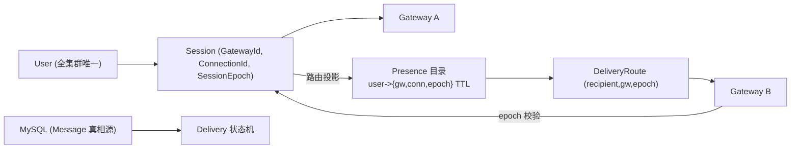

# P4 集群 Context Map：所有权边界与归属

状态：`定稿`（P4-00 冻结目标；[ADR-0002](../adr/0002-cluster-ownership-and-failure-contract.md) `accepted`；P4-01 起约束实现）

基线：`main` @ `6bfbf2e`

关联：[P4 实施计划](../plans/post-p2-implementation-plan.md) §8、[集群故障与所有权契约](../specs/cluster-failure-contract.md)、[架构演进方案](evolution-plan.md) §7

本图定义 Gateway/Connection/Session/Presence/Delivery 五个集群词汇的边界与归属。单机词汇（Message、Conversation、Delivery 状态机、ACK 等）仍以根 [CONTEXT.md](../../CONTEXT.md) 为准，本图不重定义。

## 1. 词汇与唯一含义

| 术语 | 定义 | 所有权 | Avoid |
|------|------|--------|-------|
| **Gateway** | 一个运行 ChatServer 的进程/容器实例；接受连接、执行业务、按路由投递。全集群由唯一 GatewayId 标识 | 拥有它之上的 Connection 与 Session | 节点、服务器（泛称） |
| **GatewayId** | Gateway 的稳定集群寻址标识；跨节点 RPC/路由按它寻址 | 分配方案 P4-01 RED 前冻结 | 进程 pid、IP:port（不单独作为标识） |
| **Connection** | 一条 TCP 连接；ConnectionId 只在所属 Gateway 内唯一（登录前即存在，与 P3 executor lane-key 同一来源语义） | 恰属一个 Gateway | 全局连接号 |
| **Session** | 一个已登录 User 的在线会话；跨 Gateway 唯一，同一 User 全集群至多一个活动 Session；由 `(UserId, SessionEpoch)` 界定，并记录在哪个 `(GatewayId, ConnectionId)` 上 | 由持有连接的 Gateway 代表；Presence 只是它的路由投影 | 连接、在线状态 |
| **SessionEpoch** | 单调递增的会话代数；每次登录（重新绑定）递增；renew/release/投递都携带它做 fencing | 由 claim 生成，Gateways 只读 | generation（进程内语义，P3） |
| **PresenceLease** | Presence 目录中 `user_id -> {gateway_id, connection_id, session_epoch}` 的可过期条目（TTL）；只含路由与 epoch | 由所属 Gateway claim/renew/release | 消息真相、在线标志（持久化影子） |
| **DeliveryRoute** | 一条已接受 Message 对某个接收者的目标路由 `(recipient, gateway_id, session_epoch)`，由当前 PresenceLease 决定 | 投递动作归 Gateway；路由裁决归 Presence | 持久存储位置 |

## 2. 边界与归属

| 边界 | 归属（owner） | 只读方 | 事实来源 |
|------|---------------|--------|----------|
| Connection 生命周期 | 所属 Gateway | 仅自己（其他 Gateway 不可见） | Gateway 内连接表 |
| Session 绑定与解绑 | 持有连接的 Gateway | 其他 Gateway 通过 Presence 读路由 | login/logout/close 回调 |
| Presence 条目 `(claim/renew/release)` | 持有连接的 Gateway，且必须带当前 epoch（CAS） | 全部 Gateway（locate） | Redis（P4-02 adapter） |
| Message 与 Delivery 真相 | 无单点 owner：由 MySQL 事务与状态机共同裁决 | 全部 Gateway 读，accept/ACK 写 | MySQL（唯一真相源） |
| 投递动作 | 目标路由 Gateway（epoch 匹配时） | 发送者 Gateway 通过 broker/直投发起 | DeliveryRoute + epoch 校验 |

## 3. 关键不变式

- 同一 User 全集群至多一个活动 Session；重复登录只可能因新旧 epoch 交替产生"短暂双路由"，由 fencing 收敛到新 epoch。
- Presence 条目永不携带消息真相；从 Redis 读到的只有路由，读不到 Message/Delivery 状态。
- 跨节点投递永远校验目标 GatewayId+SessionEpoch；epoch 不匹配的包丢弃并触发重路由，绝不按旧 epoch 继续投递。
- claim 总是生成新 epoch 并原子覆盖既有条目，无需旧 lease 已过期。
- MySQL 是唯一裁决者：Presence 崩溃/Redis down 只影响路由可用性，不影响已接受消息的持久化与状态推进。

## 4. 与 P3 单机结构的对应

| P3 单机 | P4 集群 |
|---------|---------|
| SessionRegistry（进程内 `byConnection_/byUser_`） | 拆为 Gateway 本地会话表 + PresenceDirectory port（P4-01），进程内部分保留为本地快照 |
| generation（`beginSessionAttempt` 代次） | 演进为 SessionEpoch；fencing 语义从"本进程旧 completion"扩展到"旧 Gateway/旧 epoch" |
| LocalOutboxRelay wakeup 本实例 | 出口替换为 OutboxPublisher port（P4-03），跨 Gateway 由 broker 事件驱动 |
| lease_owner 编 `"uid:gen[:bootid]"`（boot id=进程标识） | 增加 GatewayId 寻址维度；boot id 仍用于进程内跨重启重领，GatewayId 用于集群路由 |
| Delivery 只投本进程连接 | 按 DeliveryRoute 投目标 Gateway；本地/跨节点共用同一状态机与 ACK 语义 |
