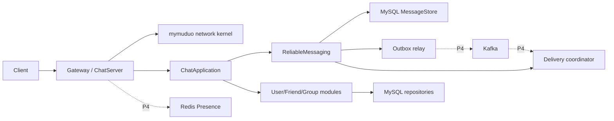

# muduo-chat 架构演进方案

状态：当前目标架构

当前基线：P1/P2 已完成；详细状态见 [进度索引](../process/implementation-progress.md)

当前执行入口：[P2 之后的实施计划](../plans/post-p2-implementation-plan.md)

原始 brainstorm 与 P0–P5 全量初稿已归档到 [evolution-plan-original.md](../archive/design/evolution-plan-original.md)，不再作为当前任务队列。

## 1. 目标与边界

项目从课程级聊天服务器演进为可验证的高性能分布式网络服务框架，顺序是：

1. 网络内核正确且资源有界。
2. 应用与阻塞依赖隔离，多 Reactor 可安全运行。
3. 单机消息具备持久接受、幂等、ACK、重试和局部顺序。
4. 多节点 Presence、Outbox/Kafka 和 Gateway 路由遵守同一消息契约。
5. 只根据 profile 和可复现报告进行性能优化。

明确不承诺：端到端 exactly-once、全局消息顺序、未经测量的连接数/吞吐、未完成 P3 就接入 Kafka 可靠链路，以及没有热点证据的 io_uring/内存池改写。

## 2. 当前已落地基线

| 能力 | 当前事实 | 证据入口 |
|---|---|---|
| 网络内核 | v1/v2 codec、TimerQueue、有界发送、过载/EMFILE、loop-affine close、信号退出、异步日志 | [P1 review](../reviews/p1-completion-review-00db852.md) 与 P1R 归档任务 |
| 应用 seam | ChatApplication、User/Friend/Group/Message Repository 的 in-memory/MySQL adapters | P2 归档任务与进度索引 |
| 阻塞隔离 | 有界 BlockingExecutor 与有 deadline 的 ConnectionPool | P2-03/P2-04 归档任务 |
| 多 Reactor | 连接归属固定，1/2/4/8 loops 有正确性和性能记录 | [多 Reactor 报告](../reports/p2-multireactor-benchmark.md) |
| M2 验收 | 配置、关闭顺序、运行指标、Debug/ASan/TSan 与 Release 证据 | [M2 报告](../reports/p2-m2-gates.md) 与 [P2 对抗审查](../reviews/p2-adversarial-review.md) |

当前主要架构债务集中在消息生命周期：在线消息绕过持久化、离线消息读后删除、没有 ClientMessageId/MessageId/客户端 ACK，且 executor 依赖全局单 worker 保序。

## 3. 目标拓扑



MySQL 是 Message 真相源；Redis 只保存可过期路由状态；Kafka 只传递可重放事件。网络 write、Redis Presence 或 broker offset 都不能替代 MessageAcceptance/DeliveryAcknowledgement 状态。

## 4. 模块与 interface

| Module | 小 interface | 隐藏的复杂性 | Adapters / 测试面 |
|---|---|---|---|
| `mymuduo` | accept/connect/send/close/timer | epoll、线程亲和、生命周期、背压、fd 耗尽 | socketpair/process tests |
| `ChatApplication` | `handle(SessionContext, Command) -> Reply` | 鉴权、用例编排、错误映射 | 通过内部 ports 使用 in-memory/MySQL adapters |
| `ReliableMessaging` | accept、acknowledge、session available/closed、start/stop | 事务、幂等、序号、租约、ACK、重试、Outbox、保留 | in-memory/MySQL MessageStore；session/recording DeliverySink |
| `SessionSerialExecutor` | keyed submit/shutdown/metrics | 同 Session FIFO、跨 Session 并行、公平与有界队列 | production/inline deterministic adapters |
| `PresenceDirectory` | claim/renew/locate/release(epoch) | TTL、fencing、降级 | P4 in-memory/Redis adapters |
| `Telemetry` | counter/gauge/histogram/span | 聚合、导出、采样、基数预算 | recorder/Prometheus/OTel adapters |

interface 同时是调用面和测试面。不要为测试暴露私有容器；只有生产与测试/替代实现都真实存在时才建立 seam。SessionRegistry 在 P3 仍是进程内实现，P4 才演进为 PresenceDirectory port。

## 5. 线程与所有权规则

- Channel、fd 和 connection callbacks 只在所属 EventLoop 修改。
- 任意线程可调用的网络 interface 必须在内部 marshal 到 owner loop，并拥有排队数据/对象生命周期。
- EventLoop 不执行 SQL、连接池等待、broker/Redis 阻塞调用或大批量序列化。
- P3 前 executor 保持单 worker；P3 顺序语义稳定后改为同 Session 串行、不同 Session 并行。
- Message 的 ConversationSequence 由数据库事务决定，不依赖 worker 完成顺序。
- 关闭顺序为停止接入、drain 网络、停止新应用任务、drain/cancel executor、关闭依赖、退出 loops。

## 6. 可靠消息契约

详细术语见根领域词汇表（CONTEXT.md，已于项目收尾移除），候选决定见 [ADR-0001](../adr/0001-reliable-message-semantics.md)。ADR 仍为 `proposed` 时不得修改协议或 schema。

目标承诺：

- Message、ConversationSequence、recipient Deliveries 与 OutboxEvent 在同一事务提交后，服务器才返回 MessageAcceptance。
- 发送端用 `(sender User, ClientMessageId)` 幂等重试；重复请求返回原 MessageId/sequence。
- Delivery 是 at-least-once；TCP write 只是 DeliveryAttempt，接收端按 MessageId 去重并显式 DeliveryAcknowledgement。
- 只保证 Conversation 内接受和投递顺序，不保证全局顺序。
- 群消息在有界 fan-out cap 内固定接收者快照；大群异步 fan-out 需要新的语义设计和实测依据。
- 旧 `OfflineMessage` 只在 expand/backfill/cutover/rollback-window 完成后删除。

## 7. 多节点演进

P4 进入条件：M3 故障矩阵通过，同一请求不产生两个 Message，ACK/重试/顺序和旧表迁移均完成。

### Presence 与 fencing

```text
presence:{user_id} -> {gateway_id, connection_id, session_epoch}, TTL
```

claim 生成单调 epoch；renew/release 必须携带相同 epoch；旧连接不能释放或接收新 Session 数据。Redis 不可用时暂停新登录和跨节点直投，但 durable MessageAcceptance 仍写入 MySQL。

### Outbox 与 Kafka

- relay 发布未处理 OutboxEvent，key 固定为 ConversationId。
- publish/consume 均允许重复；消费者通过数据库状态幂等。
- offset 提交晚于状态处理；crash/rebalance 后可重放。
- Gateway 只能根据 Presence 的 GatewayId+SessionEpoch 定向投递。

RPC、服务发现和一致性哈希只有在真实进程边界/所有权问题出现时才进入，不为“分布式感”提前增加。

## 8. 可观测性与性能方法

关键指标至少覆盖：

- connections、accept/reject reason、outstanding bytes、EventLoop lag。
- executor queue/drop、pool active/wait/timeout。
- message accepts/duplicates/conflicts、pending/inflight/acked/expired、ACK latency。
- oldest pending、outbox/consumer lag、presence fencing conflicts。
- log drops、dependency error/timeout 和 graceful/forced shutdown。

benchmark 必须记录 commit、build type、硬件/kernel、负载、持续时间、warmup、原始结果与不可外推边界。流程固定为 `Profile → 找到热点 → 写门槛 → 最小优化 → 同负载复测`。没有 profile 证据时，io_uring、零拷贝、内存池和全仓语言标准升级不进入默认路径。

## 9. 里程碑与硬闸门

| 里程碑 | 状态/目标 | 进入下一阶段的硬条件 |
|---|---|---|
| M1 网络框架 v2 | 已完成 | 网络资源有界，sanitizer/process/fault 路径通过 |
| M2 非阻塞聊天内核 | 已完成 | 慢 DB 不阻塞 loop，多 Reactor 与关闭路径有证据 |
| M3 可靠单机消息 | 当前计划 | durable accept、ACK/retry/dedup/order、migration 故障矩阵一致 |
| M4 可靠多节点 | 未开始 | Presence fencing、Kafka 重放、3 Gateway chaos 后可恢复 |
| M5 性能研究版 | 未开始 | 每个数字可定位到 commit、环境、原始报告和统计脚本 |

任何阶段正确性闸门失败时，不继续实施依赖它的后续架构。当前任务顺序和逐项完成定义只以 [post-p2-implementation-plan.md](../plans/post-p2-implementation-plan.md) 为准。
