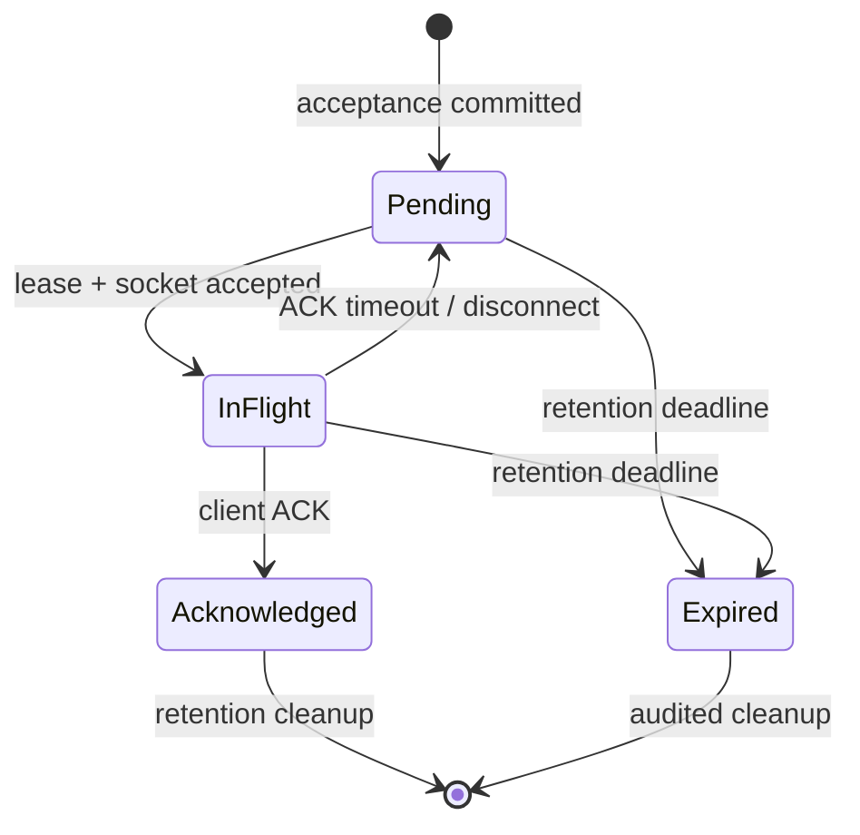
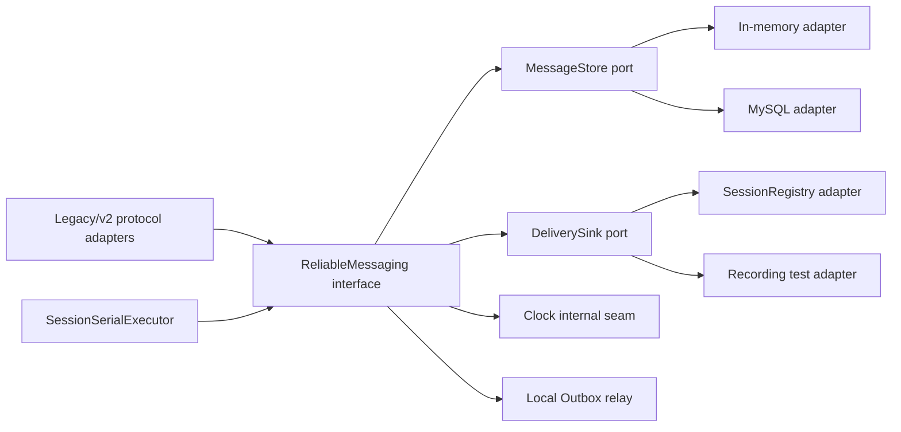
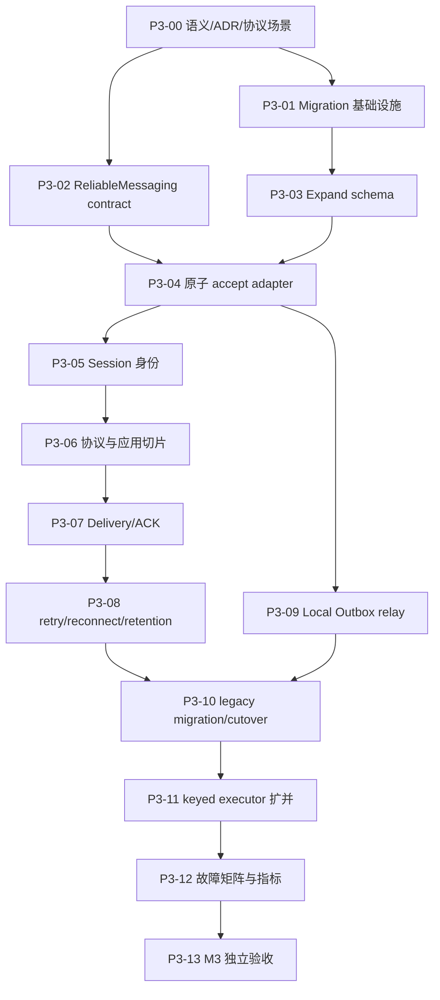

# P2 之后的详细实施计划

计划日期：2026-08-11

计划基线：`main` @ `2e2a7f9`

状态：`READY_FOR_P3-00`

关键输入：

- [架构演进方案](../architecture/evolution-plan.md) 第 6 节可靠消息契约
- [M2 验收报告](../reports/p2-m2-gates.md) 的性能与验收矩阵
- [P2 对抗审查](../reviews/p2-adversarial-review.md) 的最终结论
- [ADR-0001](../adr/0001-reliable-message-semantics.md) 的 proposed 可靠消息承诺
- 根目录 [CONTEXT.md](../../CONTEXT.md) 的领域词汇

## 1. 当前事实与计划边界

P2 已在仓库中完成到 M2：阻塞数据库工作移出 EventLoop，多 Reactor 已开启，配置与有界关闭路径已经落地，最终对抗审查记录 Debug/ASan/TSan 184/184。2026-08-11 又从 `2e2a7f9` 在全新 `/tmp/muduo-chat-post-p2-2e2a7f9-debug` 目录完成 Debug configure/build 和 184/184 CTest 复验。后续不重写 P2，而是在现有 seam 上替换消息生命周期。

P3 的直接基线事实：

| 当前事实 | 影响 |
|---|---|
| 在线单聊直接写 socket，不先持久化 | TCP/进程故障窗口内可丢，不能称 durable accept |
| 离线消息保存整段协议 JSON 到 `OfflineMessage.message VARCHAR(500)` | 领域 Message 与协议原文耦合，容量和演进受旧表限制 |
| 登录时 `SELECT` 后立即 `DELETE`，早退再尽力恢复入队 | 客户端确认前已删除；恢复任务被拒绝时仍可丢 |
| 相同 payload 重试产生两行 | 没有稳定幂等键 |
| 群聊成员查询失败仍给发送者 `errno=0` | 当前确认不能代表持久接受 |
| 发送者取自 JSON `id`，一个连接可切换多个 User | 无法可靠界定幂等键和 ACK 的主体 |
| executor 被配置强制为单 worker | 业务吞吐约 123 msg/s，正确性依赖全局 FIFO |
| 测试 fixture 内联建表，没有版本化 migration | 无法证明现存五表数据库的可升级与回滚路径 |

M3 范围只包括单 MySQL 真相源下的可靠单机消息：durable acceptance、幂等重试、Conversation 局部顺序、接收端 ACK、重试/重连、Outbox 本地 relay、旧离线表迁移和有证据的 executor 扩并。

M3 明确不包括 Redis、Kafka、跨 Gateway RPC、服务发现、跨地域复制、全局顺序或 exactly-once。它们必须等待 M3 故障矩阵通过。

## 2. 推荐语义与权衡

编码前由 P3-00 审阅下列具体场景，并把 ADR-0001 从 `proposed` 改为 `accepted`。若产品选择不同，先改 ADR、glossary 和本计划，不能让代码自行决定语义。

| 问题 | 推荐决定 | 代价 |
|---|---|---|
| 接受点 | Message、sequence、Deliveries、OutboxEvent 同一事务提交后才返回 `MESSAGE_ACCEPTED` | 在线消息也必须经过数据库写入 |
| 投递保证 | at-least-once；客户端按 MessageId 去重并显式 ACK | ACK 丢失会看到重复 DeliveryAttempt |
| 幂等范围 | `UNIQUE(sender_id, client_message_id)` | 客户端必须跨重试保存 ClientMessageId |
| 顺序 | 只保证 Conversation 内 accepted/delivery 顺序 | 热点 Conversation 会成为自然串行点 |
| 群成员 | 接受事务内以 Delivery 行固定接收者快照；发送者必须是群成员；超过配置 fan-out cap 时拒绝 | 行为收紧 B-18，大群异步 fan-out 留到有实测需求后设计 |
| 发送者身份 | 从已认证 Session 获取，忽略/拒绝伪造 `id` | 行为收紧 B-21，旧客户端需要升级 |
| TCP write | 只记一次 DeliveryAttempt，不记 Acknowledged | 需要 ACK timeout 与重投 |
| 过期 | 未确认 Delivery 到 retention deadline 后进入 `Expired`，不静默删除 | 需要可查询指标和清理策略 |
| legacy 客户端 | 暂时走同一 ledger 的 implicit-ack compatibility adapter，但不属于 M3 可靠性承诺 | 迁移期存在能力差异，必须可观测并设置退出日期 |
| MessageId | 初版由共享 MySQL 生成 `BIGINT UNSIGNED` | 未来若对写库分片需另做 ID 迁移；P4 共享写库不受影响 |

建议的初始状态机：



同一 `(recipient, conversation)` 最多允许一个未确认的 sequence 在途；ACK 丢失时先重投同一个 MessageId，再放行后续 sequence。这个选择用 head-of-line blocking 换取可解释的局部投递顺序。不同 Conversation 可以并行。

## 3. 模块形状

P3 不把 `MessageRepository` 扩成一组 SQL 风格 CRUD。建立一个深 `ReliableMessaging` 模块，让网络层只学习四类领域动作：接受消息、接收 ACK、Session 上线、Session 下线。重试、租约、Conversation 分配、事务、Outbox 与清理全部隐藏在模块内部。



建议外部 interface：

```cpp
class ReliableMessaging {
public:
    AcceptOutcome accept(const AuthenticatedSession&, const SendMessageCommand&);
    AckOutcome acknowledge(const AuthenticatedSession&, MessageId);
    void sessionAvailable(const AuthenticatedSession&);
    void sessionClosed(const AuthenticatedSession&);
    void start();
    void stop(Deadline);
};
```

`MessageStore` 与 `DeliverySink` 是内部 seam：前者有 in-memory/MySQL 两个 adapter，后者有真实 SessionRegistry/recording 两个 adapter。Clock 只作为模块内部确定性测试 seam，不泄漏到网络 interface。

删除测试策略：新 contract 稳定且 legacy cutover 完成后，删除直接锁定 `storeOffline/takeOffline` 实现细节的旧测试；保留协议兼容和迁移测试。测试面与调用面都经过 `ReliableMessaging` interface。

## 4. P3 任务依赖



除 P3-01 与 P3-02 在写入路径完全不重叠时可由用户明确授权并行外，默认严格串行。任一时刻只有一个任务为 `IN_PROGRESS`。

## 5. P3 详细任务卡

### P3-00 固定可靠消息语义与协议场景

- 依赖：P2-10 与 P2 对抗审查 `VERIFIED`。
- 接口/可观察行为：固定 MessageAcceptance、ClientMessageId、MessageId、ConversationSequence、DeliveryAcknowledgement 的含义；明确群成员快照、Session 身份与 legacy 能力差异。
- 基线证据：用当前进程测试证明重复 one-chat 产生两行、在线路径不落库、登录取走即删除、群查询失败仍 ACK 0。该纯决策任务不伪造单元测试 RED。
- 最小修改：完成 `docs/specs/message-reliability.md` 的协议表、状态机、故障点和兼容策略；场景审阅通过后将 ADR-0001 标为 `accepted`；同步 `CONTEXT.md`。
- 验证命令：`rg -n 'MessageAcceptance|ClientMessageId|MessageId|ConversationSequence|DeliveryAcknowledgement|exactly-once' CONTEXT.md docs`；逐项核对 B-09/B-11/B-12/B-17/B-18/B-19/B-21/B-22。
- 完成定义：对“accept 回复丢失、ACK 丢失、重连、重复 ACK、群成员变化/超 cap、发送者伪造、过期”都有唯一预期结果；没有 `success/delivered` 等未定义词。
- 提交边界：只含 glossary、ADR、协议/场景文档与任务卡，建议 `docs(message): define reliable delivery contract`。

### P3-01 建立版本化 migration 与 schema 验证工具

- 依赖：P3-00 `VERIFIED`；数据库变更授权明确。
- 接口/可观察行为：`migrate --to <version>` 在空库和现有五表库上幂等升级；版本、checksum 和执行时间可查询；并发执行只有一个持锁者。
- RED：新增 `SchemaMigrationTest`，当前因没有 `schema_migrations`、版本目录和 runner 失败；测试还要捕获 `sql/chat.sql` 与 `MySqlTestFixture` 双份 DDL 漂移。
- 最小实现：把无种子基线 DDL 移入 `sql/migrations/0001_baseline.sql`；新增 additive migration runner、checksum、MySQL advisory lock；测试 fixture 只调用 runner，测试种子单独维护。
- 回滚策略：expand 阶段只新增表/索引；应用回滚不删除新对象。破坏性 contract migration 必须是后续独立提交，不能用通用 down 脚本伪装数据可逆。
- 验证命令：`ctest --test-dir /tmp/muduo-chat-build/debug -R 'SchemaMigration' --output-on-failure`；分别从空库、五表快照、已升级库执行；两个 runner 并发竞争。
- 完成定义：同一 migration 不重复执行，改过的已执行文件因 checksum 不符而 fail-fast；生产服务器启动不自动抢跑 migration。
- 提交边界：migration 工具/基线与测试，不含可靠消息表，建议 `build(db): add versioned schema migrations`。

### P3-02 建立 `ReliableMessaging` interface 与 in-memory contract

- 依赖：P3-00 `VERIFIED`。
- 接口/可观察行为：接受 direct/group Message、重复接受返回相同 identity、按接收者 claim、ACK 幂等、租约到期可重领、Conversation 内顺序稳定。
- RED：`ReliableMessagingContractTest` 先因 types/interface 不存在失败；至少覆盖同 key 重试、不同 payload 复用 key 冲突、每接收者独立状态、重复 ACK、跨 Conversation 并行语义。
- 最小实现：领域值类型、一个小外部 interface、in-memory MessageStore adapter、RecordingDeliverySink 和可控 Clock；不写 SQL、不接网络。
- 验证命令：`ctest --test-dir /tmp/muduo-chat-build/debug -R 'ReliableMessagingContract' --output-on-failure`；property test 生成随机 retry/ACK/clock 序列。
- 完成定义：测试只穿过 ReliableMessaging interface，不读取容器；同一 contract 将复用于 MySQL adapter；raw JSON 不进入领域类型。
- 提交边界：interface、in-memory adapter、test adapter 与 contract，建议 `feat(message): define reliable messaging contract`。

### P3-03 Expand：新增 Conversation/Message/Delivery/Outbox schema

- 依赖：P3-01、P3-02 `VERIFIED`。
- 接口/可观察行为：additive migration 后旧 P2 二进制仍可启动；新约束能阻止重复 ClientMessageId、重复 sequence 和重复 recipient Delivery。
- RED：schema contract 先断言目标表、索引、外键和唯一约束；当前 0001 baseline 不满足而失败。
- 最小实现：新增 0002 expand migration，只新增下节定义的表/索引；不改、不删 `OfflineMessage`。
- 故障测试：逐条违反唯一约束/FK；大 payload 边界；事务回滚不留孤儿；migration 中断后重跑。
- 验证命令：`ctest --test-dir /tmp/muduo-chat-build/debug -R 'SchemaMigration|ReliableMessageSchema' --output-on-failure`；旧 P2 Release 二进制对升级库做启动 smoke。
- 完成定义：空库与旧库升级结果 checksum 一致；旧表数据/行数不变；schema 文档与 migration 一致。
- 提交边界：一个 migration、schema contract 和文档，建议 `feat(db): expand schema for reliable messages`。

### P3-04 实现 MySQL 原子接受、幂等与序号分配

- 依赖：P3-03 `VERIFIED`。
- 接口/可观察行为：一个 `accept` 事务完成 Conversation 查找/创建、成员快照、sequence 分配、Message、Deliveries、OutboxEvent；重复 `(sender, ClientMessageId)` 返回原结果。
- RED：每个 SQL 步骤后注入失败；8/32 线程并发同 id、同 Conversation、不同 Conversation；当前 adapter 不存在而失败。
- 最小实现：MySQL MessageStore adapter 和内部 RAII TransactionGuard；Conversation 行 `SELECT ... FOR UPDATE` 或等价原子更新；唯一键竞争后读取已提交原结果；fan-out cap 值与接受事务绑定，RED 前记录该值。
- 错误语义：deadlock/lock timeout 映射 `DependencyBusy`，调用方以相同 ClientMessageId 重试；不同 payload 复用 key 返回 `IdempotencyConflict`，超过 fan-out cap 返回 `TooManyRecipients`，不得悄悄当重复成功。
- 验证命令：`ctest --test-dir /tmp/muduo-chat-build/debug -R 'MySQLReliableMessaging|ReliableMessagingContract|MessageAcceptanceConcurrency' --repeat until-fail:10 --output-on-failure`。
- 完成定义：任一故障点都不存在部分 Message/Delivery/Outbox；同 Conversation sequence 唯一且严格递增；不同 Conversation 可并行提交。
- 提交边界：MySQL adapter、内部 transaction helper 和 integration tests，建议 `feat(message): commit acceptance atomically`。

### P3-05 绑定一个连接、一个认证 Session 与一个发送者身份

- 依赖：P3-04 `VERIFIED`。
- 接口/可观察行为：登录成功后 Connection 绑定一个 User+generation；同一连接切换 User 被拒；消息/ACK 主体只来自 Session，不信任 JSON `id`。
- RED：未登录发消息、Alice 伪造 Bob id、同连接二次登录另一 User、旧 generation ACK、断开与重连竞争；当前 B-21 行为应失败。
- 最小实现：深化现有 `_userConnMap` 为内部 SessionRegistry module，维护 connection→session 与 user→session 双向一致性；不提前引入 Presence port。
- 验证命令：`ctest --test-dir /tmp/muduo-chat-build/debug -R 'SessionApplication|AuthenticatedSession|DomainCharacterization' --output-on-failure`，TSan 重复 20 轮。
- 完成定义：没有路径从 payload 选择 sender/acker；注册、好友、群组旧行为除明确 ADR 变化外不回退；断开释放恰好一次。
- 提交边界：SessionRegistry、登录/断开适配与测试，建议 `fix(session): bind message identity to authenticated connections`。

### P3-06 接入 MessageAcceptance 协议与应用切片

- 依赖：P3-05 `VERIFIED`。
- 接口/可观察行为：direct/group 命令携带 ClientMessageId 与 typed content；`MESSAGE_ACCEPTED` 返回 ClientMessageId、MessageId、ConversationId、ConversationSequence 和 `duplicate`。
- RED：accept 回复被测试代理丢弃后，同 command 重试得到同 identity；不存在用户/群、非群成员、超限 content、幂等冲突、DB busy 返回稳定错误。
- 最小实现：两个协议 adapter 把 JSON 转换成 `SendMessageCommand`；ChatService 只负责 codec/session/Reply 映射，Message 接受进入 executor 后调用 ReliableMessaging。
- 兼容：旧 msgid 6/10 缺 ClientMessageId 时生成 legacy identity 并标记 implicit-ack 模式；内部仍走同一 ledger，不保留第二套 storeOffline 实现；指标单独计数。
- 验证命令：`ctest --test-dir /tmp/muduo-chat-build/debug -R 'MessageAcceptanceApplication|ReliableProtocolGolden|DualProtocol' --output-on-failure`；v1/v2 golden JSON 与进程测试。
- 完成定义：在线/离线走同一 durable accept 路径；事务提交前不会回复 accepted；群查询失败不再成功；500-byte 旧表上限不再支配新 Message content 上限。
- 提交边界：协议常量/文档、adapter、应用切片和客户端 fixture，建议 `feat(protocol): expose durable message acceptance`。

### P3-07 实现有租约的 Delivery 与客户端 ACK

- 依赖：P3-06 `VERIFIED`。
- 接口/可观察行为：Session 上线后 claim 自己的 Pending Delivery；socket 准入成功转 InFlight；客户端按 MessageId ACK；重复/迟到/他人 ACK 幂等且不越权。
- RED：socket WouldBlock/Closed、发送后断线、ACK 丢失、Bob ACK Carol 消息、同 ACK 重复、lease owner 崩溃；当前无 ACK 路径而失败。
- 最小实现：DeliveryCoordinator、SessionDeliverySink/Recording adapter、claim token 与 lease；每个 `(recipient, conversation)` 一条 InFlight 上限。
- 网络联动：只有 `TcpConnection::SendOutcome.disposition` 已接受才记录 attempt；PauseProducer 时等待 low-water 回调，不自旋；Closed 时保留 Pending。
- 验证命令：`ctest --test-dir /tmp/muduo-chat-build/debug -R 'DeliveryCoordinator|DeliveryAck|BackpressureDelivery' --repeat until-fail:20 --output-on-failure`；ASan/TSan。
- 完成定义：TCP write completion 不会直接 ACK；接收端重复展示可由 MessageId 去重；ACK 后不会再 claim；Conversation 内不越过未确认前序。
- 提交边界：DeliveryCoordinator、ACK protocol、sink adapters 和测试，建议 `feat(message): track client-acknowledged deliveries`。

### P3-08 实现 ACK timeout、重连续传、过期与保留

- 依赖：P3-07 `VERIFIED`。
- 接口/可观察行为：ACK timeout 后相同 MessageId 重投；重连立即唤醒 pending；offline 不消耗快速重试额度；到 expiresAt 后进入 Expired；acked/expired 按独立 retention 清理。
- RED：丢 ACK 后重复 attempt、服务重启、Session generation 变化、时钟跨越多个 retry、断线一小时再登录、过期边界和重复 cleanup。
- 最小实现：ReliableMessaging 内部 timer 驱动的 bounded batch scheduler，指数 backoff+jitter 与可控 Clock；参数从 config 注入，测试不依赖 sleep。
- 初始参数：任务卡在 RED 前记录 ack timeout、backoff cap、message retention 和 cleanup batch；正式值须由 fault test/负载报告支持，不把测试小值带入生产。
- 验证命令：`ctest --test-dir /tmp/muduo-chat-build/debug -R 'DeliveryRetry|ReconnectReplay|MessageRetention' --output-on-failure`；kill/restart process test。
- 完成定义：当前 `takeOffline` 读删流程已不在新路径；重试任务有界、退出可 drain/cancel；过期可查询而非静默丢失。
- 提交边界：retry/reconnect 与 retention 分两个提交，分别建议 `feat(message): retry unacknowledged deliveries`、`feat(message): expire and retain delivery records`。

### P3-09 让 Outbox 在单机路径真实工作

- 依赖：P3-04、P3-08 `VERIFIED`。
- 接口/可观察行为：未处理 OutboxEvent 可用 lease 批量 claim；本地 relay 唤醒 DeliveryCoordinator；成功后标记 processed，失败/崩溃后可重领。
- RED：commit 后 relay 前 kill、处理后标记前 kill、重复处理、两个 relay 竞争、poison event；当前只有表记录而没有消费者。
- 最小实现：LocalOutboxRelay 与 RecordingOutbox adapter；同一 MessageAccepted 事件重复处理只产生幂等 wakeup。Kafka port 不在 P3 创建。
- 验证命令：`ctest --test-dir /tmp/muduo-chat-build/debug -R 'OutboxRelay|OutboxCrashRecovery' --repeat until-fail:10 --output-on-failure`；MySQL process kill/restart。
- 完成定义：周期扫描保证 lost wakeup 后仍推进；relay 队列/批次有界；未处理/重试/poison 指标可见；P4 能替换 relay 出口而不改 accept 事务。
- 提交边界：relay、lease SQL、测试和指标，建议 `feat(message): relay durable outbox events locally`。

### P3-10 迁移旧 `OfflineMessage` 并完成 expand/migrate/contract

- 依赖：P3-08、P3-09 `VERIFIED`，bundled clients 已支持 MessageId/ACK。
- 接口/可观察行为：可解析旧行转换为 Message+Delivery，使用 `legacy:<offline_id>` 幂等；不可解析行进入可查询 quarantine，绝不静默删除。
- RED：旧五表快照含单聊、群聊、重复、乱码/坏 JSON、迁移中断；当前 runner 不会迁移而失败。
- 最小实现：可重入 backfill tool、checkpoint、dry-run 与计数核对；过渡期读取新 ledger 并只对尚未迁移的旧行 fallback，禁止长期双写两套业务实现。
- 发布顺序：expand → 新代码兼容读 → backfill → 比对计数/hash → 新路径默认 → 观察窗口 → 禁止旧写 → 独立 contract migration。应用回滚窗口关闭前不 DROP 表。
- 验证命令：`ctest --test-dir /tmp/muduo-chat-build/debug -R 'LegacyOfflineMigration|SchemaMigration|ReconnectReplay' --output-on-failure`；完整数据库快照升级/回滚演练。
- 完成定义：源行=已迁移+quarantine，重复运行不增加 Message；线上代码不再调用 `storeOffline/takeOffline`；旧表删除是单独、可延后的提交。
- 提交边界：backfill、cutover、contract 三个提交，最后建议 `refactor(message): retire legacy offline queue`。

### P3-11 用 keyed serial executor 替代全局单 worker

- 依赖：P3-10 `VERIFIED`，可靠消息顺序由数据库与 Delivery 状态机保证。
- 接口/可观察行为：同 Session key 的 command FIFO；不同 key 可并行；completion 回提交时的 origin EventLoop；全局与每 key 队列均有界且公平。
- RED：同 key 1000 任务严格顺序、不同 key 慢任务并行、热 key 不饿死其他 key、满队列、deadline、Session generation 失效、shutdown；当前多 worker 会破坏语义。
- 最小实现：`SessionSerialExecutor` 的 per-key lane + N worker ready queue；pre-login 用 ConnectionId，登录后用 `(UserId,generation)`；不按 Conversation 分片，Conversation 顺序由 MySQL transaction 决定。
- Adapter：生产 keyed executor 与 deterministic inline adapter 共用 submit interface；删除强制 `executor.workers == 1` 的 config 限制前先完成全部 correctness tests。
- 验证命令：Debug/TSan 执行 `ctest --test-dir <build-dir> -R 'SessionSerialExecutor|DomainCharacterization|MultiReactor|ReliableMessage' --repeat until-fail:20 --output-on-failure`。
- 完成定义：1/2/4/8 workers 行为等价；同 Session 顺序不回退；过载 fail-fast；吞吐/尾延迟报告后才改变默认 worker 数。
- 提交边界：executor module、ChatService wiring、config 与 tests；默认值变更另提一提交，建议 `feat(app): parallelize sessions with serial task lanes`。

### P3-12 建立可靠消息指标与故障矩阵

- 依赖：P3-11 `VERIFIED`。
- 接口/可观察行为：至少暴露 accepts/duplicates/conflicts/rejected-too-many-recipients、pending/inflight/acked/expired、attempts/retries、ACK latency、oldest pending age、outbox lag/poison、legacy-mode count。
- RED：test recorder 对每个状态迁移断言 counter/gauge/histogram；高基数字段进入 metric label 时测试失败。
- 故障矩阵：accept 回复丢失、每个事务 failpoint、commit 后 kill、socket RST、ACK 丢失、DB down/timeout、relay kill、重连到新 Session、过期、进程优雅/强制退出。
- 最小实现：扩展现有 METRICS snapshot 与结构化事件；进程代理只负责 drop/delay/kill，不窥探数据库私有实现。
- 验证命令：`ctest --test-dir /tmp/muduo-chat-build/debug -R 'ReliableMessageMetrics|ReliableMessageFaultProcess' --output-on-failure`；Debug/ASan/TSan；每个 kill 点至少 10 轮。
- 完成定义：每个故障点的数据库状态、客户端可见结果和恢复动作与 ADR 一致；失败能由指标定位；不以“最终测试绿”替代原始故障日志。
- 提交边界：metrics/test recorder 与 fault harness 分开，建议 `test(message): exercise the reliable delivery fault matrix`。

### P3-13 M3 独立验收、性能矩阵与对抗审查

- 依赖：P3-00 至 P3-12 全部 `VERIFIED`。
- 正确性矩阵：in-memory/MySQL contract、空库/旧库 migration、direct/group、v1/v2、online/offline、retry/reconnect、legacy cutover、1/2/4/8 workers。
- 工具矩阵：全新 Debug、ASan+UBSan、TSan、Release tests-off；并发/fault 套件重复；`git diff --check`、schema checksum、协议 golden、文档状态唯一。
- 性能矩阵：复用 P2 workload，并新增 reliable direct/group、ACK 正常/丢失、hot/cold Conversation；记录 msg/s、accept/ACK p50/p95/p99、DB lock wait、executor queue、oldest pending、outbox lag。
- 接受门槛：与 P2 ~123 msg/s 基线比较时解释 durable write 带来的成本；不预设提升比例。默认 worker 数只由正确性全绿且可复现的曲线决定。
- 对抗审查：Standards、Spec、Concurrency/Fault、Migration/Security 四轴；High/Medium 未决为 0 才标 M3 `VERIFIED`。
- 完成定义：同一请求不产生两个 Message；已接受 Message 在定义的 retention 内最终 ACK 或保持可查询 Pending/Expired；Conversation 无重复/倒退 sequence；不宣称 exactly-once。
- 提交边界：只含报告、状态和必要文档，建议 `docs: verify M3 reliable messaging gates`。

## 6. 目标 schema 契约

物理名称可在 P3-03 任务卡中微调，但不允许削弱以下约束：

```text
Conversation(
  id BIGINT UNSIGNED PK,
  kind DIRECT|GROUP,
  next_sequence BIGINT UNSIGNED
)

DirectConversation(
  conversation_id PK/FK,
  user_low_id FK,
  user_high_id FK,
  UNIQUE(user_low_id, user_high_id)
)

GroupConversation(
  conversation_id PK/FK,
  group_id UNIQUE/FK
)

ChatMessage(
  id BIGINT UNSIGNED PK,
  conversation_id FK,
  sender_id FK,
  client_message_id ASCII(1..64),
  sequence BIGINT UNSIGNED,
  content MEDIUMBLOB,
  created_at,
  UNIQUE(sender_id, client_message_id),
  UNIQUE(conversation_id, sequence)
)

MessageDelivery(
  message_id FK,
  recipient_id FK,
  state Pending|InFlight|Acknowledged|Expired,
  attempt_count,
  next_attempt_at,
  lease_owner,
  lease_until,
  last_sent_at,
  acknowledged_at,
  expires_at,
  PRIMARY KEY(message_id, recipient_id),
  INDEX(recipient_id, state, next_attempt_at)
)

OutboxEvent(
  id BIGINT UNSIGNED PK,
  aggregate_message_id FK,
  event_type,
  payload,
  available_at,
  lease_owner,
  lease_until,
  attempt_count,
  processed_at,
  UNIQUE(event_type, aggregate_message_id)
)
```

`MessageDelivery.state` 的数据库编码必须由 adapter 隐藏，不能让数值/字符串泄漏到领域 interface。content 上限由应用配置和 codec 上限共同决定，数据库列容量不是业务规则。

## 7. 协议兼容最小集合

可靠发送命令至少包含：

```json
{
  "msgid": "ONE_CHAT or GROUP_CHAT",
  "client_message_id": "stable-client-id",
  "toid or groupid": 42,
  "content": "hello"
}
```

接受响应至少包含：

```json
{
  "msgid": "MESSAGE_ACCEPTED",
  "client_message_id": "stable-client-id",
  "message_id": 123,
  "conversation_id": 9,
  "sequence": 17,
  "duplicate": false
}
```

接收端 ACK 至少包含 `msgid=DELIVERY_ACK` 与 `message_id`。UserId 从 Session 获取，不由 ACK payload 提供。具体整数编码在 P3-06 的 protocol golden 中一次冻结；本计划不随意占用当前枚举值。

## 8. P4 任务队列：可靠多节点

P4 只有在 P3-13 `VERIFIED` 后启动。以下任务已经足够拆卡，但 Redis/Kafka 客户端、版本和部署参数必须在开始任务时基于当前官方文档重新确认。

### P4-00 固定集群故障与所有权契约

- Interface：GatewayId、ConnectionId、SessionEpoch、PresenceLease、DeliveryRoute；MySQL 继续是 Message 真相源。
- RED 场景：快速重登、旧 Gateway 延迟 release、网络分区、Redis down、Gateway kill、broker 重放。
- 最小实现：集群 ADR、context map、3 Gateway Compose 拓扑；不写生产 adapter。
- 完成：每个依赖故障都有 accept/login/delivery 降级结果，建议提交 `docs(cluster): define ownership and failure contract`。

### P4-01 PresenceDirectory interface 与 in-memory contract

- Interface：`claim/renew/locate/release` 全部携带 epoch；release 为 compare-and-delete。
- RED：旧 epoch renew/release、TTL、并发 claim、clock jump、dependency unavailable。
- 最小实现：deep PresenceDirectory module + in-memory adapter/controllable clock。
- 验证：`ctest -R 'PresenceContract'`；完成条件是状态转换原子且错误可区分。

### P4-02 Redis fencing adapter

- RED：真实 Redis 下并发 claim、旧节点延迟 release、timeout、restart、主从切换可用环境。
- 最小实现：Lua claim/renew/release，键值只含路由和 epoch，不含消息真相。
- 验证：Redis integration 与 fault tests；Redis down 时暂停新登录/跨节点直投，durable accept 继续。
- 提交：`feat(cluster): add fenced redis presence adapter`。

### P4-03 OutboxPublisher port 与 Kafka adapter

- Interface：批量 publish MessageAccepted，key 固定 ConversationId；返回逐事件结果。
- RED：commit 后 publish 前 kill、publish 后 processed 前 kill、broker timeout、重复 publish。
- 最小实现：P3 LocalOutboxRelay 出口替换为 port；Recording 与 Kafka 两个 adapter；有界 batch/backoff。
- 完成：未发布事件可重放，重复 publish 不改变 Message/Delivery，建议 `feat(cluster): publish outbox events to kafka`。

### P4-04 幂等 Delivery consumer

- Interface：消费 MessageAccepted 后只推进既有 Delivery，不重复创建状态；offset 提交晚于数据库幂等处理。
- RED：处理后 offset 前 kill、rebalance、重复/乱序事件、poison event。
- 最小实现：consumer + dedup/fencing；dead-letter 必须可查询，不能只日志丢弃。
- 完成：任意重放次数状态一致，Conversation partition 内顺序不倒退。

### P4-05 Gateway 定向投递与 epoch 校验

- Interface：Delivery 只发送到 Presence 指向的 GatewayId+SessionEpoch；旧 epoch 收到消息时丢弃并触发重路由。
- RED：Alice/Bob 分处两节点、投递中重连、旧 Gateway 延迟包、目标 Gateway crash。
- 最小实现：先 in-process GatewayTransport/recording adapter；只有确实拆进程时增加 v2 TCP RPC adapter。
- 完成：本地/跨节点共用同一 ACK 与 MessageId 语义，不出现第二套消息状态机。

### P4-06 三节点 chaos 与容量保护

- 矩阵：kill -9 Gateway/relay/consumer，Redis delay/down，Kafka pause/duplicate，MySQL timeout，网络分区与恢复。
- 指标：presence stale/claim conflicts、outbox lag、consumer lag/rebalance、route retry、oldest pending。
- 验证：固定种子 chaos 重复至少 20 轮；恢复后已接受消息 ACK 或保持可查询状态。
- 完成：依赖恢复不需人工改库；已有连接和控制面不会被恢复风暴压垮。

### P4-07 M4 独立验收

- 全新单元/integration/process/chaos、ASan/TSan、3 Gateway Compose 与 Release 构建。
- High/Medium 未决为 0；不把单机 success 当集群通过。
- 提交：`docs: verify M4 multi-node reliability gates`。

## 9. P5 任务队列：证据驱动性能与可观测性

### P5-00 Telemetry interface 与基数预算

- 定义 counter/gauge/histogram/span 小 interface，生产 Prometheus/OTel 与 test recorder 两个 adapter。
- RED：trace parent/error、metric 单调性、label cardinality budget；UserId/MessageId/ClientMessageId 禁止作为 metric label。
- 完成：EventLoop、executor、pool、message/outbox/presence/broker 的关键故障可从统一信号定位。

### P5-01 Dashboard、告警与 SLO 实验

- 基于实测定义连接接受、MessageAcceptance latency、ACK latency、oldest pending、outbox/consumer lag、EventLoop lag。
- 故障注入必须触发对应告警并在恢复后自动清除；没有生产流量前称“实验 SLO”，不称生产 SLA。

### P5-02 固定 benchmark 与 profile 基线

- 固定硬件、编译 flags、数据规模、网络模型、warmup、重复次数、原始 JSON schema 和置信区间。
- 场景：connect、echo、slow consumer、reliable direct/group、hot Conversation、DB/Redis/Kafka backpressure。
- 产物：perf/FlameGraph、锁等待、分配、syscall、cache miss 与端到端 latency 对齐到 commit。

### P5-03 只修实测热点

- 候选包括批量 SQL/ACK、Outbox batch、序列化拷贝、Buffer 分配、锁分片；每项先 profile 再写性能门槛。
- 正确性/fault matrix 先通过，优化前后相同负载；一个优化一个提交，可独立回滚。

### P5-04 内核与 I/O 实验隔离

- io_uring、sendmmsg/recvmmsg、零拷贝、内存池都作为独立 spike，不进入默认路径，除非 profile 证明 syscall/分配是主要瓶颈。
- 每个 spike 有 feature flag、fallback adapter、正确性对照和 sanitizer/benchmark；无收益就删除。

### P5-05 M5 证据包

- 每个对外数字能定位到 commit、机器、配置、原始输出与统计脚本。
- 区分 synthetic benchmark、故障演练和真实生产数据；没有真实生产数据就明确写“实验环境”。
- 最终对抗审查通过后提交 `docs: publish M5 evidence package`。

## 10. 全局执行与停止规则

每个任务固定执行：

1. 核对 HEAD、上游状态、唯一活动任务和允许写入范围。
2. 写公开 interface 的失败测试，记录命令、退出码和目标失败原因。
3. 只实现让目标测试通过的最小代码。
4. 聚焦 GREEN、Debug 全量、适用 Sanitizer、进程/依赖测试。
5. `git diff --check`、diff stat、逐文件审查、文档/schema/protocol 同步。
6. 更新任务卡与进度，做一个原子提交。

以下情况立即停止，不继续叠架构：

- ADR-0001 尚未 accepted 就开始改协议/schema。
- migration 不能从旧五表快照重放，或需要静默丢弃旧行。
- 测试意外通过，说明 RED 没覆盖目标。
- MySQL/Redis/Kafka integration 被 skip。
- 同一请求出现两个 MessageId、sequence 重复/倒退、他人可 ACK。
- ACK/重试故障矩阵失败却开始 Kafka 或多节点。
- 性能回退无法由 durable write、锁、队列或测量噪声解释。
- 为测试新增只有一个 adapter 的公开 seam，或测试必须读取模块私有容器。
