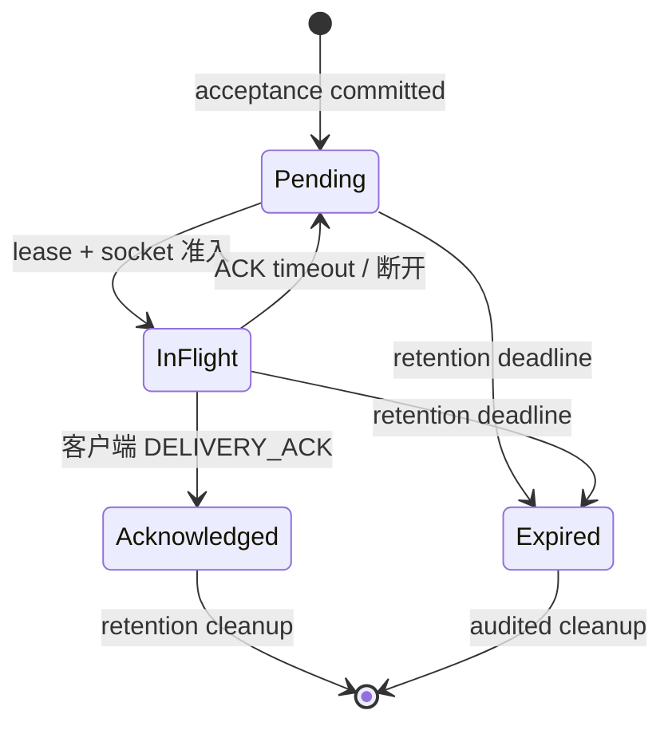

# P3 可靠消息协议与场景规范（P3-00 核心产出）

状态：`定稿`（P3-00 场景审阅通过；[ADR-0001](../adr/0001-reliable-message-semantics.md) 已 `accepted`；审阅通过后才 accepted 的顺序由 §8 与任务卡固定）

基线：`main` @ `5373503`

关联：

- [ADR-0001](../adr/0001-reliable-message-semantics.md)：本规范引用的承诺来源
- [P3 实施计划](../plans/post-p2-implementation-plan.md) §2 推荐语义与权衡、§5 P3-00 任务卡、§6 目标 schema 契约、§7 协议兼容最小集合
- [CONTEXT.md](../../CONTEXT.md)：术语来源，本规范全部英文术语与之一致
- [行为矩阵](domain-behavior-matrix.md)：B-09/B-11/B-12/B-17/B-18/B-19/B-21/B-22 为现状基线，新规范是目标（§6 对照）

## 1. 目标承诺

本规范把 ADR-0001 的承诺展开为可测试的协议与场景语义。以下承诺是 P3 全部实现的不可回退约束：

| 承诺 | 内容 |
|------|------|
| Durable acceptance（持久接受） | 同一事务提交 Message、ConversationSequence、全部接收者 Delivery、OutboxEvent 之后才返回 MessageAcceptance；事务提交前不发出已接受确认 |
| Idempotent accept（幂等接受） | 幂等键为 `(sender User, ClientMessageId)`，对应 schema `UNIQUE(sender_id, client_message_id)`；同键重试返回原 MessageId、原 sequence，不产生第二行 |
| At-least-once delivery（至少一次投递） | TCP 写入只是 DeliveryAttempt；接收端客户端按 MessageId 去重并显式发送 DeliveryAcknowledgement；服务器从不承诺 exactly-once |
| Local order（局部顺序） | 只保证 Conversation 内 accepted/delivery 顺序；不同 Conversation 可并行 |
| Group snapshot（群成员快照） | 接受事务内以 Delivery 行固定接收者快照；发送者必须是群成员；成员数超过 fan-out cap 时拒绝（cap 值未定，P3-04 前冻结） |
| Session identity（会话身份） | 发送者与 ACK 主体只来自已认证 Session，从不信任 payload 的 `id` 字段 |
| Legacy compatibility（兼容） | legacy 客户端走同一 ledger 的 implicit-ack adapter；能力差异必须可观测（指标）并设置退出日期 |
| MessageId 生成 | 初版为 `BIGINT UNSIGNED`，由共享 MySQL 生成（计划 §2） |

失败判定（停止规则，计划 §10）：同一请求出现两个 MessageId、sequence 重复/倒退、他人可 ACK，立即停止。

## 2. 协议

协议表适用于 v1/v2 双 codec（DualProtocol golden 保持对称，计划 §5 P3-06）。

### 2.1 可靠发送命令

| 消息 | msgid | 字段 | 约束 |
|------|-------|------|------|
| ONE_CHAT | 6（既有值，不变，B-22） | `client_message_id`（新增）、`toid`、`content` | `client_message_id` 为 ASCII 1..64 字节（对应 schema `ASCII(1..64)`），大小写敏感（'abc' 与 'ABC' 是不同 ClientMessageId，schema 以 `ascii_bin` 排序规则落地）；缺失 → legacy 判定（§5.1）；格式非法 → InvalidClientMessageId |
| GROUP_CHAT | 10（既有值，不变，B-22） | `client_message_id`（新增）、`groupid`、`content` | 同上；非成员发送 → NotConversationMember（B-18 收紧） |

可靠客户端必须跨重试保存 client_message_id；同一消息意图重试时不得更换（计划 §2）。

### 2.2 MESSAGE_ACCEPTED

| 字段 | 含义 |
|------|------|
| `client_message_id` | 回显命令中的值 |
| `message_id` | 服务器分配的 MessageId；同键重试时返回原值 |
| `conversation_id` | 目标 Conversation；同键重试时返回原值 |
| `sequence` | ConversationSequence；同键重试时返回原值 |
| `duplicate` | 同键重试时 true，首次接受 false；不同 payload 复用同键不是 duplicate（→ IdempotencyConflict） |

MESSAGE_ACCEPTED 只在该事务提交后发出（Durable acceptance 承诺）。

### 2.3 DELIVERY_ACK

- 客户端 → 服务器，至少包含 `message_id`（计划 §7）。
- UserId 从已认证 Session 获取，不由 ACK payload 提供（Session identity 承诺）。
- 重复、迟到、他人 ACK：幂等且不越权（§4 故障点 4/5）。

### 2.4 错误分类

| 错误 | 语义 | 客户端动作 |
|------|------|-----------|
| DependencyBusy | accept 事务 lock timeout / deadlock | 以同一 ClientMessageId 重试 |
| IdempotencyConflict | 同 `(sender, ClientMessageId)` 但 payload 不同 | 不重试；更换 key 或人工处理；不得被当作 duplicate=true |
| TooManyRecipients | 群成员数超过 fan-out cap（cap 值 P3-04 前冻结） | 不得当作已接受；同 key 重试仍返回同一错误 |
| NotConversationMember | 非群成员发送群聊 | 获得成员资格后以新意图发送 |
| NotFound | 用户/群不存在 | 修复字段 |
| InvalidClientMessageId | client_message_id 非 ASCII 或长度超 1..64 | 修复字段 |

错误响应的 msgid/errno 整数编码在 P3-06 golden 一次冻结（§2.5）；legacy 客户端继续按 CONTEXT.md 的 Errno 语义（0/1/2）获得通用失败。

### 2.5 枚举整数编码与一次冻结

- 现网 msgid 1..10 由行为矩阵 B-22 锁定，新增消息类型（MESSAGE_ACCEPTED、DELIVERY_ACK、错误响应等）不得占用 1..10。
- 新枚举的具体整数在 P3-06 的 protocol golden 中一次冻结：本规范只固定名称、字段与语义；golden 落地后数值不再变更，客户端 fixture 与 golden 同步生成（计划 §7、§5 P3-06）。
- `MessageDelivery.state`（Pending/InFlight/Acknowledged/Expired）的数据库编码由 adapter 隐藏，数值/字符串不泄漏到领域 interface（计划 §6）。

## 3. Delivery 状态机

规则：

- **顺序**：同一 `(recipient, conversation)` 至多一个未确认 sequence 在途；ACK 丢失时先重投同一个 MessageId，收到 ACK 后再放行后续 sequence（head-of-line blocking 换取可解释的局部投递顺序，计划 §2）。不同 Conversation 可并行；执行器不按 Conversation 分片，顺序由 MySQL 事务决定（P3-11）。
- **DeliveryAttempt**：TCP write 只是尝试；只有 `TcpConnection::SendOutcome.disposition` 已接受才记录 attempt；WouldBlock 等待 low-water 回调；Closed 时保留 Pending；write 完成不直接产生 ACK（计划 §5 P3-07）。
- **lease**：claim 产生 lease_owner/lease_until，到期可重领；Session generation 变化后旧 claim 失效（P3-05/P3-07）。
- **Expired 不静默删除**：可查询（指标、管理查询），只由 audited cleanup 清理（P3-08）。

参数冻结：ack timeout、backoff cap、message retention、cleanup batch 的初始值在 P3-08 RED 前记录（计划 §5 P3-08），本规范不承诺具体数值。

## 4. 故障点表

每一行有且只有一个预期结果（服务器状态与客户端可见各自唯一）；本表之外不存在"应当成功/应当送达"的分支。

| 故障点 | 服务器状态（唯一预期结果） | 客户端可见（唯一预期结果） |
|--------|---------------------------|---------------------------|
| accept 回复丢失（事务已提交，Reply 未达） | 同 key 重试不产生第二行 Message/Delivery/OutboxEvent；返回原 MessageId、原 sequence、duplicate=true | 收到 MESSAGE_ACCEPTED（duplicate=true，message_id/sequence 为原值）；同一消息意图只对应一个 message_id |
| ACK 丢失 | Delivery 在 ACK timeout 后回 Pending，按 backoff 重投同一 MessageId，attempt_count+1；同 `(recipient, conversation)` 前序未确认时不投后续 sequence | 收到重复 DeliveryAttempt（同 message_id、conversation_id、sequence）；客户端按 MessageId 去重，不重复展示 |
| 重连 | 断开 → 该 Session 名下 InFlight 立即回 Pending（P3-07 Closed 保留 Pending）；进程崩溃无清理路径时，依赖 lease 到期后重领恢复；新 Session 上线立即 claim 自己名下的 Pending（不等 backoff，offline 不消耗快速重试额度）；不 claim 他人 Delivery | 新 Session 登录后立即收到全部自己名下的 Pending 消息；重复消息由 MessageId 去重 |
| 重复 ACK | 已 Acknowledged 的 Delivery 再收 ACK：状态不变，无重投、无新写入 | 无新增 DeliveryAttempt；重复 ACK 无副作用 |
| 他人 ACK（Bob ACK Carol 的消息） | ACK 主体取自 Session；与 Delivery 的 recipient 不匹配时忽略，不改变状态 | Carol 的消息不被 Bob 的 ACK 终结，按状态机继续 |
| 群成员变化 | 接受事务内快照成员并创建 Delivery 行；接受后成员加入/退出不影响已接受消息 | 接受后加入的成员不收到该消息；已快照成员按状态机收到 |
| 超 fan-out cap | accept 事务整体拒绝，不写任何行；返回 TooManyRecipients；同 key 重试返回同一错误 | 收到稳定错误 TooManyRecipients，不是 MESSAGE_ACCEPTED，不得当作已接受 |
| 发送者伪造 id | 忽略 payload 的 `id` 字段，sender 与 ACK 主体一律取 Session；无任何路径从 payload 选 sender/acker | 伪造无意义：消息以 Session 身份入 ledger，不产生以伪造 id 为发送者的 Message |
| 过期 | 未确认 Delivery 到 expires_at 后进入 Expired；不静默删除，指标与管理查询可见；Expired 行仅由 audited cleanup 清理 | 不再收到该 Message 的重投；客户端已收到但未 ACK 的 Message 不再重试（at-least-once 不承诺无限重试） |
| DB busy / deadlock | accept 事务回滚，无部分提交；错误映射 DependencyBusy；同 key 重试，若重试时其他请求已提交同 key 则返回原结果 duplicate=true | 收到 DependencyBusy，以同一 client_message_id 重试（不更换 key） |

## 5. 兼容与迁移

### 5.1 legacy 客户端

- **判定**：ONE_CHAT/GROUP_CHAT 缺 `client_message_id` → legacy 路径（计划 §5 P3-06）。
- **legacy identity**：迁移行使用 `legacy:<offline_id>`（P3-10 backfill 幂等键）；在线 legacy 消息由服务器在 accept 时生成 `legacy:<UserId>:<进程内单调计数>`。跨重启/跨重试不保证稳定，因此 legacy 重试不享受幂等保证——这是明确的**能力差异**，legacy 不属于 M3 可靠性承诺（ADR-0001）。
- **implicit-ack**：legacy Delivery 在 socket 准入（disposition 已接受）后即标记 Acknowledged，不进入 ACK timeout/重投循环；离线 legacy 消息在登录补投时同样处理；客户端无需发送 DELIVERY_ACK。
- **同一 ledger**：内部仍走同一 ledger 与同一状态机，不保留第二套 storeOffline 实现（计划 §5 P3-06）。
- **能力差异可观测**：指标 legacy-mode count 单独计数（P3-12）；legacy identity 以 `legacy:` 前缀可查询。
- **退出日期机制**：P3-10 cutover 完成后进入观察窗口；窗口内 legacy-mode count 持续为 0 且无新 legacy 连接（指标证据）后，由部署决策宣布退出（移除 implicit-ack adapter 与 legacy identity 生成）。具体日期未定，P3-10 前冻结；本规范只承诺机制与证据要求。

### 5.2 OfflineMessage 退役顺序

发布顺序（计划 §5 P3-10）：

1. **expand**：新增新表，不改、不删 OfflineMessage（P3-03）
2. **新代码兼容读**：过渡期读新 ledger，仅对尚未迁移的旧行 fallback；禁止长期双写两套业务实现
3. **backfill**：可重入、checkpoint、dry-run、计数核对；源行 = 已迁移 + quarantine，重复运行不增加 Message
4. **比对计数/hash**
5. **新路径默认**：线上代码不再调用 storeOffline/takeOffline
6. **观察窗口**
7. **禁止旧写**
8. **独立 contract migration**（破坏性变更必须是独立提交，不用通用 down 脚本伪装可逆）
9. **回滚窗口关闭后 DROP**（旧表删除是单独、可延后的提交）

- 不可解析旧行进入可查询 quarantine，绝不静默删除。
- 回滚窗口关闭前不 DROP OfflineMessage（ADR-0001 Consequences）。

### 5.3 回滚窗口

禁止旧写、contract migration、DROP 每一步都是独立提交；在回滚窗口内可用非破坏性路径回退到上一阶段。窗口由 P3-10 观察窗口与部署决策界定，关闭前不删除任何数据。

## 6. 与现状差异（行为矩阵对照）

| 矩阵 ID | 现状（P2-00 锁定） | 新规范 | 类别 | 生效任务 |
|---------|-------------------|--------|------|----------|
| B-09 | 登录：先回 LOGIN_MSG_ACK，再逐条补投原始 Command，随后清空离线队列 | 保留"先 ACK 后补投"次序；补投演进为"新 Session claim 自己名下的 Pending Delivery"，经状态机投递；"随后清空队列"由状态机取代 | 保留/演进 | P3-05/P3-07/P3-08 |
| B-12 | 单聊：目标离线 → 整条 Command 入 OfflineMessage，登录读删 | 离线/在线统一 durable accept；读删流程保留至 P3-08 由新路径替换，之后 takeOffline 退出新路径；旧表退役见 §5.2 | 保留至替换 | P3-08/P3-10 |
| B-17 | 群聊：在线成员收原始 Command、离线成员入队、发送者 errno=0 | 收紧：accept 事务内快照成员；Delivery 由状态机驱动；确认仅在事务提交后发出 | 收紧 | P3-04/P3-06/P3-07 |
| B-18 | 非成员发群聊仍 errno=0 | 收紧：发送者必须是群成员，非成员 → NotConversationMember | 收紧 | P3-04 |
| B-19 | 成员查询失败仍 errno=0 | 收紧：查询失败/事务失败 → DependencyBusy，不再无条件下发确认 | 收紧 | P3-04 |
| B-21 | 同一连接先后登录不同 User 均成功 | 收紧：连接绑定一个认证 Session（User+generation），切换被拒 | 收紧 | P3-05 |

其他相关变化（非行为矩阵新增行）：B-11 在线直写被 ledger + Delivery 状态机替代（接受点变化）；B-22 枚举编码见 §2.5；B-13 的 500 字节上限在 P3-06 冻结新 content 上限后不再支配新路径（数据库列容量不是业务规则，计划 §6）。

## 7. 未定值冻结清单

| 项 | 冻结任务 | 说明 |
|----|----------|------|
| fan-out cap 数值 | P3-04 | §2.4 TooManyRecipients 阈值 |
| ack timeout / backoff cap | P3-08 | §3 重投参数，RED 前记录 |
| message retention / cleanup batch | P3-08 | §3 Expired/清理参数 |
| 新 msgid 整数编码 | P3-06 golden | §2.5 一次冻结 |
| content 上限 | P3-06 | §6 B-13 相关 |
| legacy 退出日期 | P3-10 | §5.1 观察窗口证据后宣布 |

## 8. 审阅与验证

- **审阅流程**：本规范经 P3-00 场景审阅通过后，ADR-0001 转 `accepted`，并同步 CONTEXT.md（计划 §5 P3-00）。
- **验证命令**：`grep -E -rn 'MessageAcceptance|ClientMessageId|MessageId|ConversationSequence|DeliveryAcknowledgement|exactly-once' CONTEXT.md docs`；逐项核对 B-09/B-11/B-12/B-17/B-18/B-19/B-21/B-22。
- **自检**：每个故障点有唯一预期结果，且全文本不存在 `success`/`delivered` 等未定义承诺词（MESSAGE_ACCEPTED、已接受等固定词除外）。
